# User guide — Academic Paper Citation Manager

**English** · [한국어](ko.md) · [中文](zh.md) · [日本語](ja.md) · [Español](es.md)

This guide walks through the plugin from collecting papers to exporting a Word manuscript.
Every screenshot was taken from the real plugin. The red numbers in each screenshot match
the numbered steps below it.

**Workflow:** collect papers → read and organize → search and ask → cite → export to Word

**Contents**

0. [Setup](#0-setup)
1. [The screen](#1-the-screen)
2. [Add papers from PubMed](#2-add-papers-from-pubmed)
3. [Add one paper by DOI or PMID](#3-add-one-paper-by-doi-or-pmid)
4. [Reference notes](#4-reference-notes)
5. [Browse the library](#5-browse-the-library)
6. [Cite in your manuscript](#6-cite-in-your-manuscript)
7. [Semantic search](#7-semantic-search)
8. [Chat with your library](#8-chat-with-your-library)
9. [Related papers](#9-related-papers)
10. [Finish the manuscript and export to Word](#10-finish-the-manuscript-and-export-to-word)

---

## 0. Setup

Install from **Settings → Community plugins → Browse**: search for "Academic Paper
Citation Manager", install it, and enable it. Then enter your AI key once.

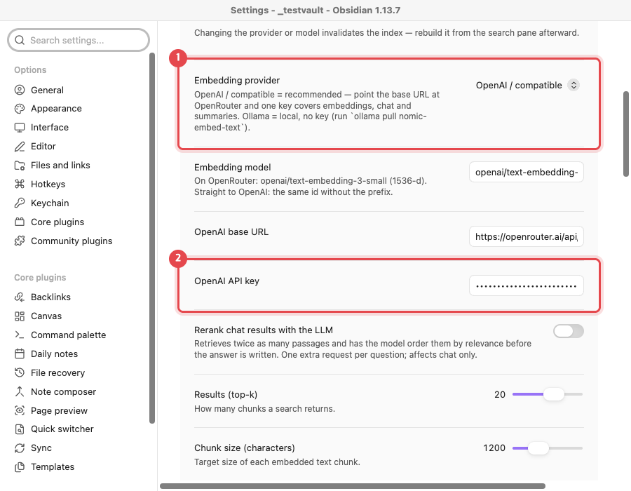

1. Leave **Embedding provider** at `OpenAI / compatible`. The default base URL is
   OpenRouter, so one key covers search, chat and summaries.
2. Paste your OpenRouter key into **OpenAI API key**. The key is kept in your system
   keychain, not in the vault files.

> **No key needed for citing.** Adding papers, `@` citations and bibliographies all work
> without an AI key. The key is only for summaries, semantic search and chat.

## 1. The screen

The plugin adds three icons to the left ribbon and a library pane on the right.

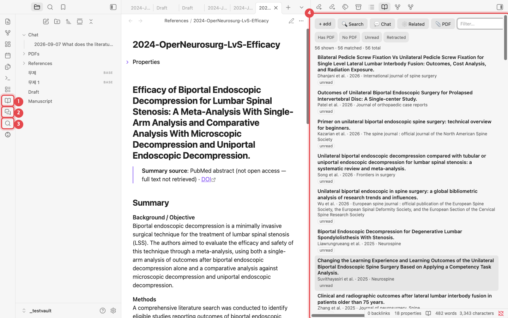

1. **Open library**: opens the list of your papers.
2. **Chat with library**: opens a chat that answers from your own papers.
3. **Search PubMed**: searches PubMed and adds papers.
4. **Library pane**: each paper is one note. Click a title to open its note.

## 2. Add papers from PubMed

The fastest way to build a library. Search, tick the papers you want, and each becomes a
note with a summary and topic tags.

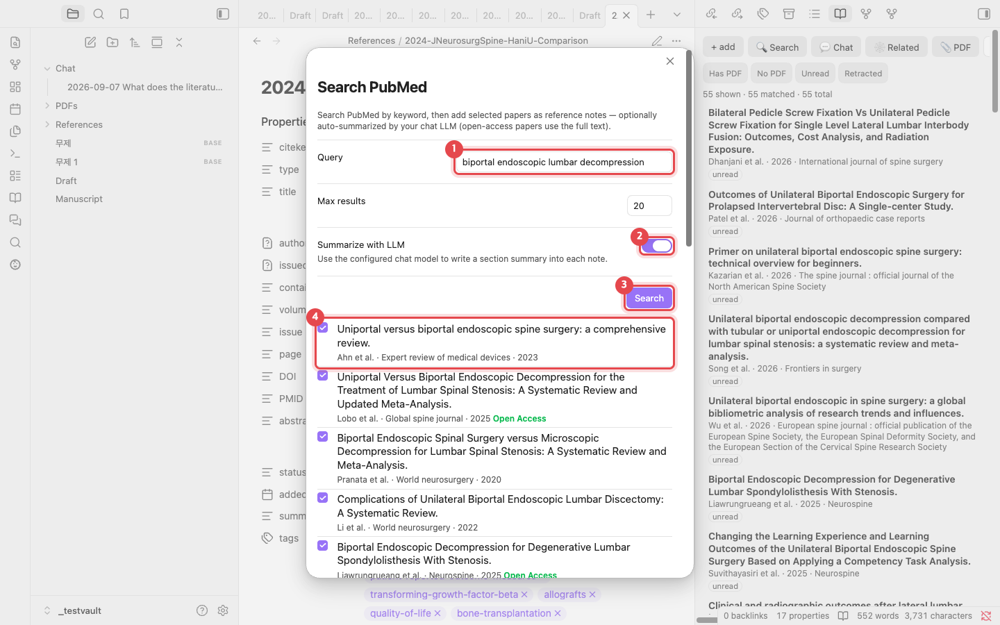

1. Type a search into **Query**, for example `biportal endoscopic lumbar decompression`.
2. Keep **Summarize with LLM** on to get a section-by-section summary in each note. For
   open-access papers the summary is written from the full text.
3. Click **Search**.
4. Tick the papers to add. Papers marked **Open Access** are summarized from the full text.

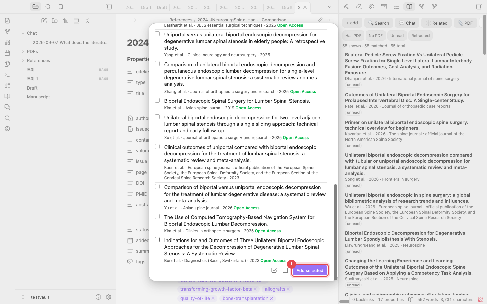

1. Click **Add selected** at the bottom of the list. The two icons next to it select all
   and clear all. Each paper takes about 10–20 seconds; an "Added 1 reference." notice
   appears when it is done.

> **No duplicates.** A paper that is already in your library is recognized by DOI, PMID or
> title and is not added again.

## 3. Add one paper by DOI or PMID

When you know the paper, paste its identifier. Click **+ add** in the library pane, or run
"Add reference by DOI / PMID / arXiv" from the command palette.

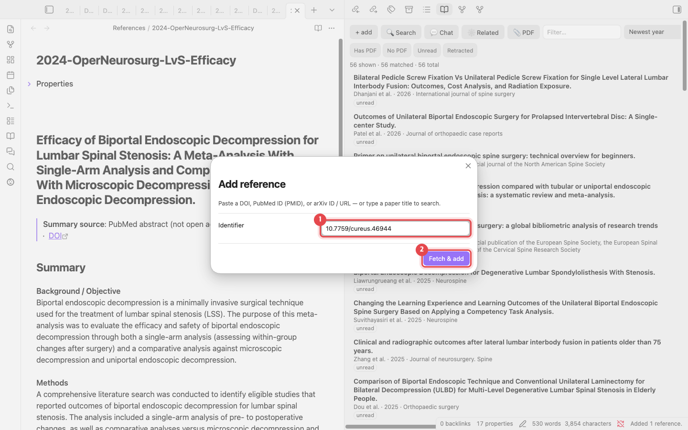

1. Enter a DOI (`10.7759/cureus.46944`), a PMID (`38021704`) or an arXiv ID. A paper title
   also works; it is searched for.
2. Click **Fetch & add**. Metadata comes from Crossref and PubMed.

> **Have a PDF?** Use **📎 PDF** in the library pane to add a paper from its PDF. The DOI
> inside the PDF is used to fill in the metadata.

## 4. Reference notes

Each paper is saved as a Markdown note in `References/`. The files are the database, so
there is no separate program such as Zotero.

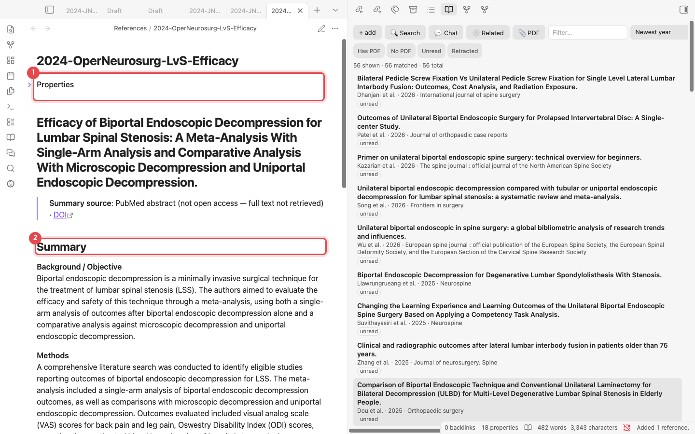

1. **Properties**: authors, year, journal, DOI, PMID and tags (from MeSH). The key used for
   citing, the `citekey` (for example `lv2024efficacy`), is here too.
2. **Summary**: Background, Methods, Results and Conclusions. Write your own notes under
   **Notes** further down.

## 5. Browse the library

Filter the library pane as it grows.

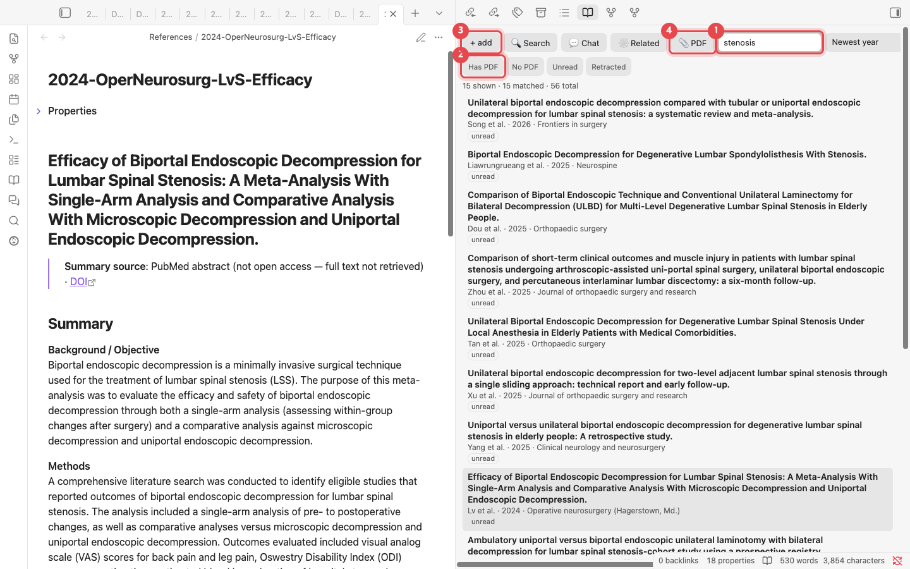

1. **Filter**: matches titles, authors and tags. Typing `stenosis` leaves 15 of 56 papers.
   The menu to the right changes the sort order (for example newest year first).
2. **Quick filters**: show only papers with a PDF, without a PDF, unread, or retracted.
3. **+ add**: opens the DOI / PMID dialog (section 3).
4. **📎 PDF**: adds a paper from a PDF file.

## 6. Cite in your manuscript

Write your manuscript in an ordinary note. Type `@` where a citation belongs.

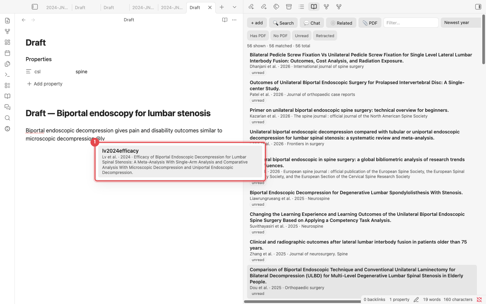

1. After `@`, type part of an author name or title to see matching papers. Press
   <kbd>Enter</kbd> to insert `[@lv2024efficacy]`.

### Build the bibliography

Put the journal style in the note's properties (`csl: spine`), then run
<kbd>Cmd/Ctrl</kbd>+<kbd>P</kbd> → **Update bibliography in current note**.

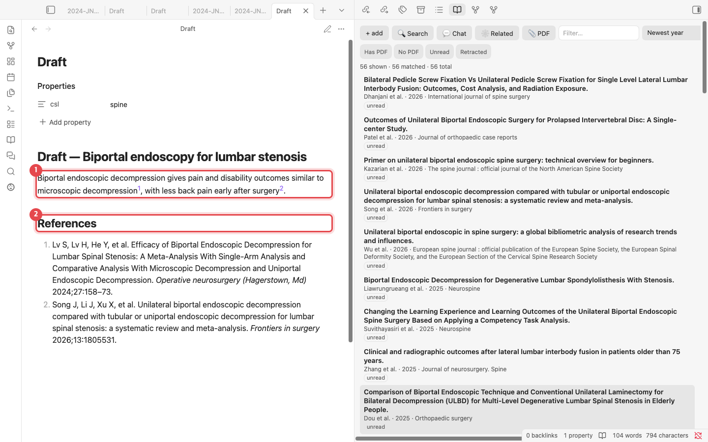

1. In reading view, each `[@citekey]` shows in the journal's style (here, superscript
   numbers).
2. A **References** section is written at the end of the note in the journal's format. Run
   the command again after adding or removing citations to update it.

> **Journal styles**: `spine`, `apa`, `american-medical-association`, `elsevier-vancouver`
> and `springer-basic-brackets` are built in. Any other style ID from the
> [CSL style repository](https://github.com/citation-style-language/styles), such as
> `vancouver` or `nature`, is downloaded on first use. Don't know the ID? Run **Choose citation
> style…** and type the journal name.

## 7. Semantic search

Finds passages with a similar meaning, even when the words differ. Open it with **Search**
in the library pane. Click **Rebuild index** once first (under a minute for about 50 papers).

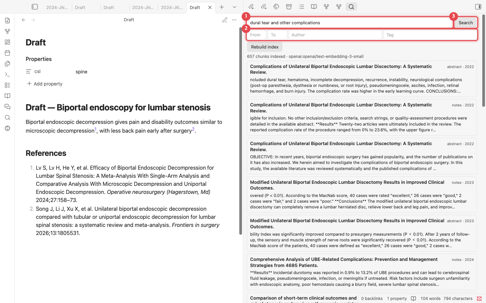

1. Describe what you are looking for, for example `dural tear and other complications`.
2. Narrow the results by year range, author or tag.
3. Click **Search**. Matching passages are listed by paper; click one to open its note.

## 8. Chat with your library

Answers come only from the papers you collected. The bracketed numbers, such as `[1]` and
`[3]`, show which paper each statement comes from.

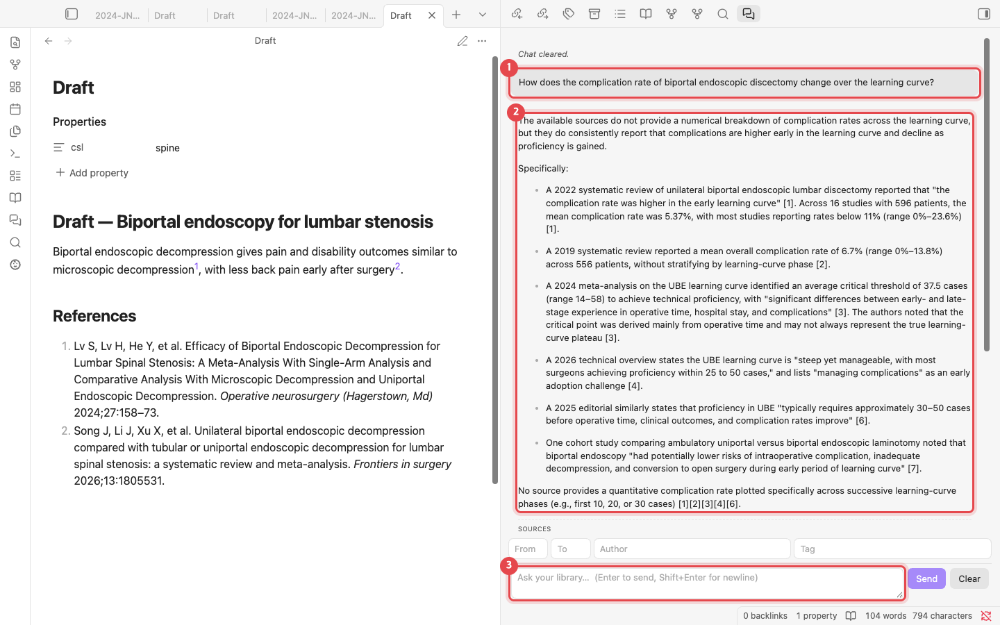

1. Your question. You can ask in any language.
2. The answer. Bracketed numbers are the sources.
3. The question box. Press <kbd>Enter</kbd> to send. The fields above it limit the sources
   by year, author or tag.

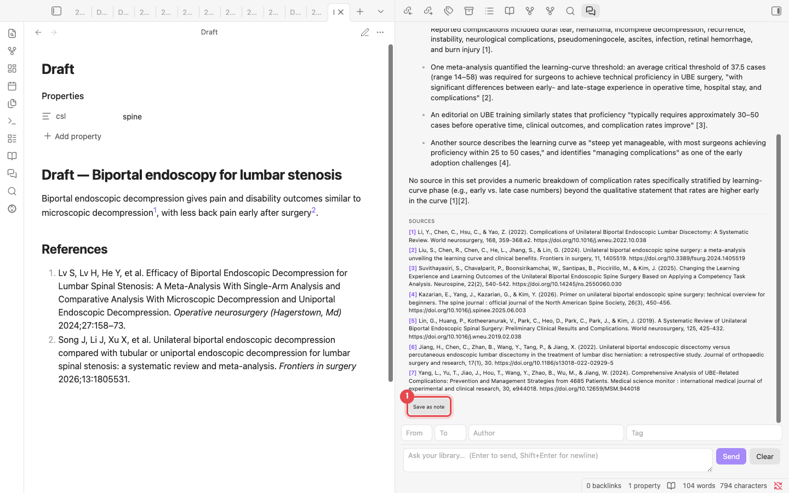

1. **SOURCES** lists the papers behind the answer. **Save as note** saves the answer in the
   `Chat/` folder and turns the sources into `[@citekey]` citations.

## 9. Related papers

Shows how your papers cite each other. Click **Build citation graph** once to fetch the
citation data from OpenAlex (about 40 seconds for 56 papers).

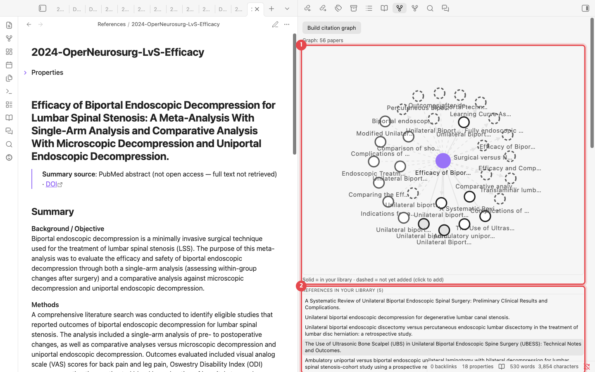

1. **Citation map**: the purple dot is the open paper. Solid circles are papers in your
   library; dashed circles are papers you do not have yet. Click a dashed circle to add it.
2. **Lists**: papers this one cites, papers that cite it, papers that share many
   references with it, and papers your library cites often but does not contain.

## 10. Finish the manuscript and export to Word

Every command is in the command palette (<kbd>Cmd/Ctrl</kbd>+<kbd>P</kbd>). Type
"Academic Paper Citation Manager" to list them.

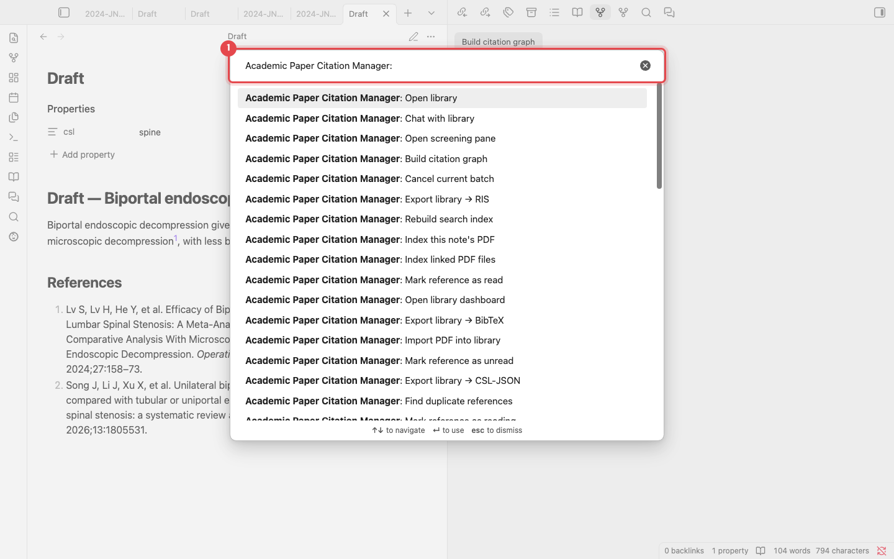

1. Type part of a command name here. The commands used most often:

| Command | What it does |
|---|---|
| Update bibliography in current note | Writes the References section of the manuscript |
| Compile manuscript | Makes a copy with `[@citekey]` replaced by formatted citations |
| Export manuscript to Word (.docx) | Compiles, then saves a Word file (needs [Pandoc](https://pandoc.org)) |
| Find unsupported claims | Lists paragraphs that make a claim without a citation |
| Suggest citations for selection | Suggests papers for the selected sentence |

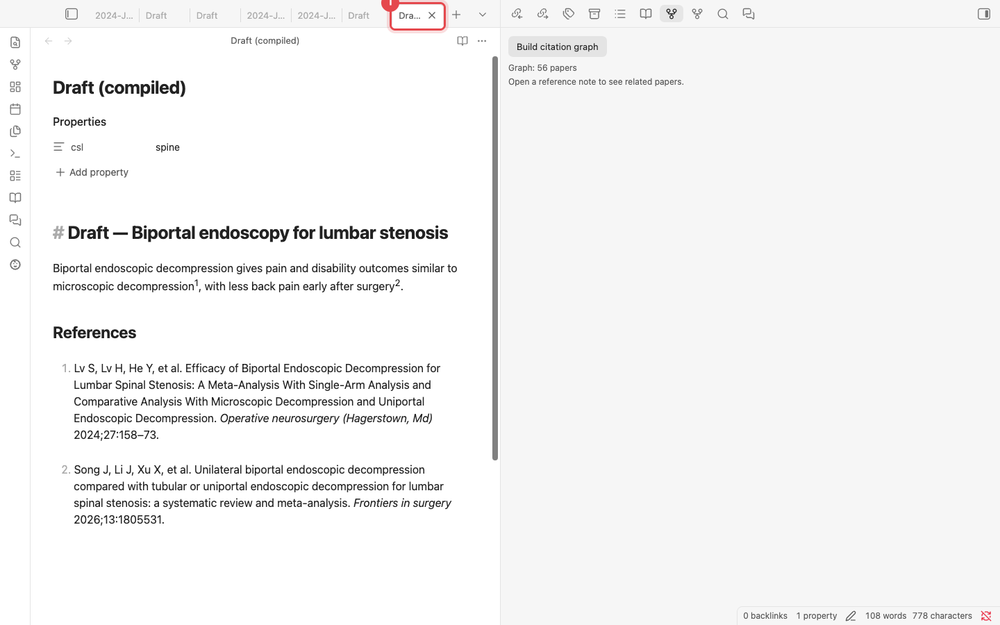

1. **Compile manuscript** leaves the original untouched and opens a new
   **Draft (compiled)** note. Citations are formatted and the reference list is attached,
   ready for submission. For a Word file, run **Export manuscript to Word (.docx)**.

---

Screenshots: plugin v0.7.8 on a test vault of 56 papers. Chat answers are unedited model
output. Maintainers regenerate the screenshots with `python scripts/manual/capture.py en`.
