# Guía del usuario — Academic Paper Citation Manager

[English](en.md) · [한국어](ko.md) · [中文](zh.md) · [日本語](ja.md) · **Español**

Esta guía recorre el complemento paso a paso, desde reunir artículos hasta exportar un manuscrito a Word. Todas las capturas se tomaron usando el complemento real. Los números rojos de cada captura corresponden a los pasos numerados debajo.

**Flujo de trabajo:** reunir artículos → leer y organizar → buscar y preguntar → citar → exportar a Word

**Contenido**

0. [Configuración](#0-configuración)
1. [La pantalla](#1-la-pantalla)
2. [Añadir artículos desde PubMed](#2-añadir-artículos-desde-pubmed)
3. [Añadir un artículo por DOI o PMID](#3-añadir-un-artículo-por-doi-o-pmid)
4. [Notas de referencia](#4-notas-de-referencia)
5. [Explorar la biblioteca](#5-explorar-la-biblioteca)
6. [Citar en tu manuscrito](#6-citar-en-tu-manuscrito)
7. [Búsqueda semántica](#7-búsqueda-semántica)
8. [Chatear con tu biblioteca](#8-chatear-con-tu-biblioteca)
9. [Artículos relacionados](#9-artículos-relacionados)
10. [Terminar el manuscrito y exportarlo a Word](#10-terminar-el-manuscrito-y-exportarlo-a-word)

---

## 0. Configuración

Instálalo desde **Preferencias → Complementos de la comunidad → Explorar**: busca "Academic Paper Citation Manager", instálalo y actívalo. Luego introduce tu clave de IA una sola vez.

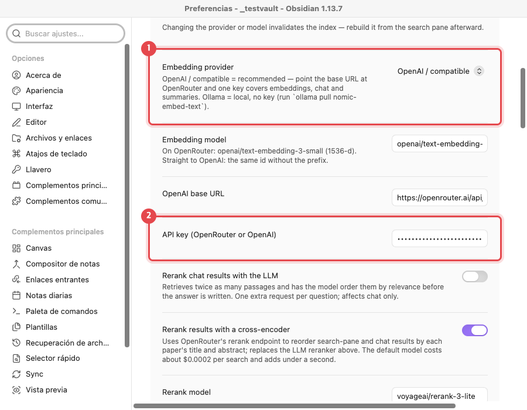

1. Deja **Embedding provider** en `OpenAI / compatible`. La URL base predeterminada es OpenRouter, así que una sola clave cubre búsqueda, chat y resúmenes.
2. Pega tu clave de OpenRouter en **OpenAI API key**. La clave se guarda en el llavero del sistema, no en los archivos del vault.

> **No hace falta clave para citar.** Añadir artículos, las citas con `@` y las bibliografías funcionan sin clave de IA. La clave solo es necesaria para resúmenes, búsqueda semántica y chat.

## 1. La pantalla

El complemento añade tres iconos a la cinta izquierda y abre un panel de biblioteca a la derecha.

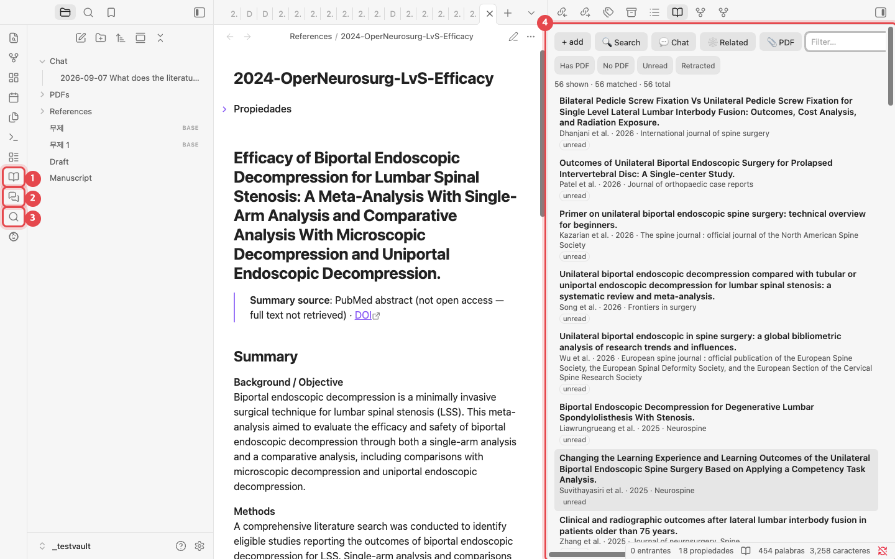

1. **Open library**: abre la lista de tus artículos.
2. **Chat with library**: abre un chat que responde a partir de tus propios artículos.
3. **Search PubMed**: busca en PubMed y añade artículos.
4. **Panel de biblioteca**: cada artículo es una nota. Haz clic en un título para abrir su nota.

## 2. Añadir artículos desde PubMed

La forma más rápida de crear una biblioteca. Busca, marca los artículos que quieras y cada uno se convierte en una nota con resumen y etiquetas de tema.

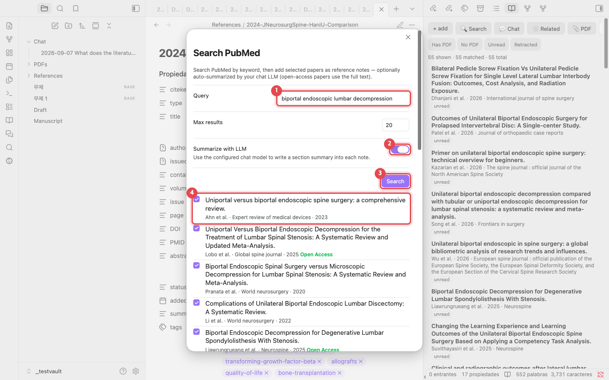

1. Escribe una búsqueda en **Query**, por ejemplo `biportal endoscopic lumbar decompression`.
2. Deja activado **Summarize with LLM** para obtener un resumen por secciones en cada nota. En los artículos de acceso abierto, el resumen se redacta a partir del texto completo.
3. Haz clic en **Search**.
4. Marca los artículos que quieras añadir. Los artículos marcados como **Open Access** se resumen a partir del texto completo.

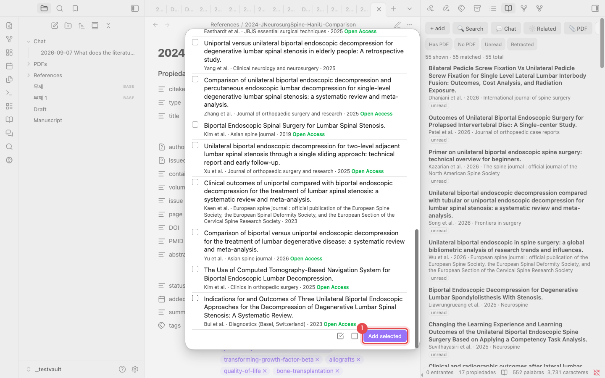

1. Haz clic en **Add selected** al final de la lista. Los dos iconos de al lado seleccionan todo y deseleccionan todo. Cada artículo tarda unos 10–20 segundos; al terminar aparece un aviso "Added 1 reference."

> **Sin duplicados.** Un artículo que ya está en tu biblioteca se reconoce por DOI, PMID o título y no se añade de nuevo.

## 3. Añadir un artículo por DOI o PMID

Cuando ya conoces el artículo, pega su identificador. Haz clic en **+ add** en el panel de biblioteca, o ejecuta "Add reference by DOI / PMID / arXiv" desde la paleta de comandos.

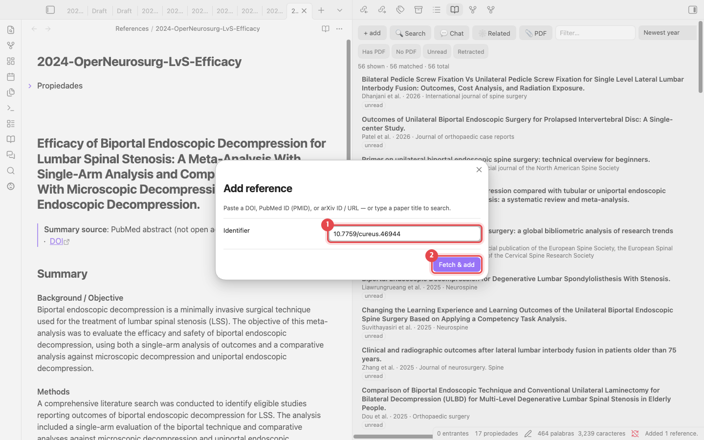

1. Introduce un DOI (`10.7759/cureus.46944`), un PMID (`38021704`) o un ID de arXiv. También funciona el título del artículo; se busca a partir de él.
2. Haz clic en **Fetch & add**. Los metadatos provienen de Crossref y PubMed.

> **¿Tienes un PDF?** Usa **📎 PDF** en el panel de biblioteca para añadir un artículo a partir de su PDF. El DOI que contiene el PDF se usa para completar los metadatos.

## 4. Notas de referencia

Cada artículo se guarda como una nota Markdown en `References/`. Los archivos son la base de datos, así que no hace falta un programa aparte como Zotero.

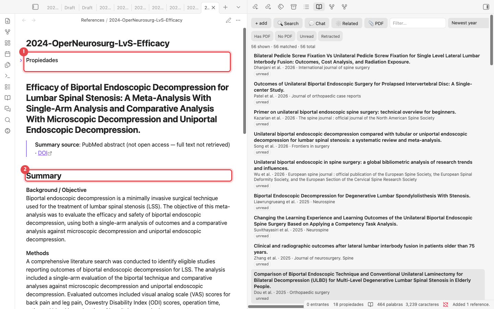

1. **Propiedades**: autores, año, revista, DOI, PMID y etiquetas (a partir de MeSH). La clave usada para citar, el `citekey` (por ejemplo `lv2024efficacy`), también está aquí.
2. **Summary**: Background, Methods, Results y Conclusions. Escribe tus propias notas más abajo, en **Notes**.

## 5. Explorar la biblioteca

Filtra el panel de biblioteca a medida que crece.

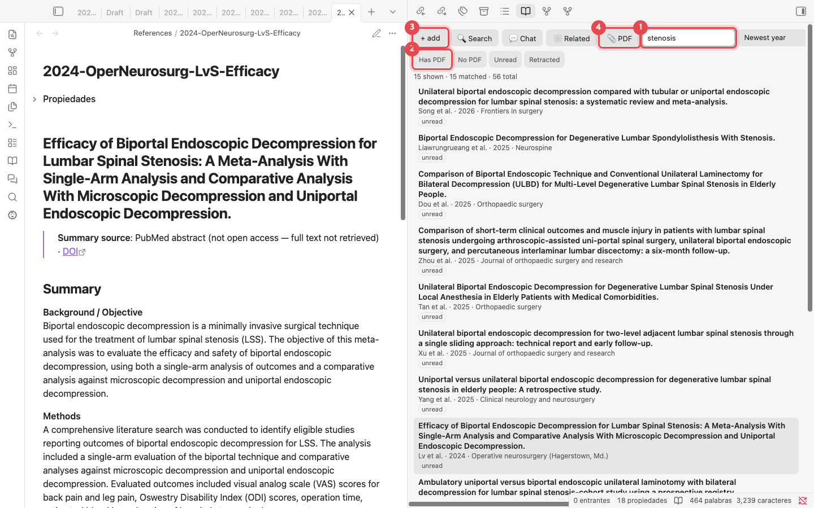

1. **Filter**: busca coincidencias en títulos, autores y etiquetas. Escribir `stenosis` deja 15 de 56 artículos. El menú de la derecha cambia el orden (por ejemplo, año más reciente primero).
2. **Filtros rápidos**: muestra solo artículos con PDF, sin PDF, sin leer o retractados.
3. **+ add**: abre el diálogo de DOI / PMID (sección 3).
4. **📎 PDF**: añade un artículo a partir de un archivo PDF.

## 6. Citar en tu manuscrito

Escribe tu manuscrito en una nota normal. Escribe `@` donde deba ir una cita.

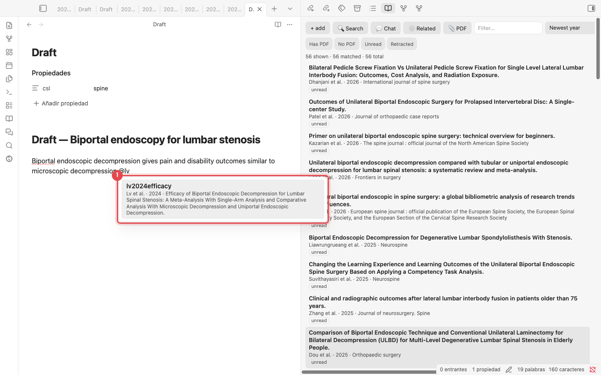

1. Después de `@`, escribe parte del nombre de un autor o del título para ver los artículos que coinciden. Pulsa <kbd>Enter</kbd> para insertar `[@lv2024efficacy]`.

### Generar la bibliografía

Pon el estilo de la revista en las propiedades de la nota (`csl: spine`) y ejecuta <kbd>Cmd/Ctrl</kbd>+<kbd>P</kbd> → **Update bibliography in current note**.

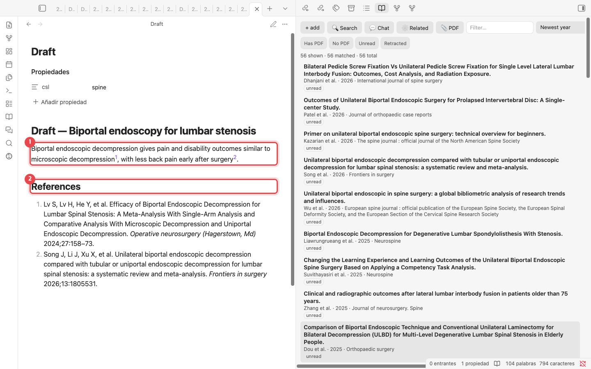

1. En la vista de lectura, cada `[@citekey]` se muestra con el estilo de la revista (aquí, números en superíndice).
2. Al final de la nota se escribe una sección **References** con el formato de la revista. Vuelve a ejecutar el comando después de añadir o quitar citas para actualizarla.

> **Estilos de revista**: `spine`, `apa`, `american-medical-association`, `elsevier-vancouver` y `springer-basic-brackets` vienen integrados. Cualquier otro ID de estilo del [repositorio de estilos CSL](https://github.com/citation-style-language/styles), como `vancouver` o `nature`, se descarga la primera vez que se usa.

## 7. Búsqueda semántica

Encuentra pasajes con un significado similar, incluso cuando las palabras son distintas. Ábrela con **Search** en el panel de biblioteca. Haz clic una vez en **Rebuild index** primero (menos de un minuto para unos 50 artículos).

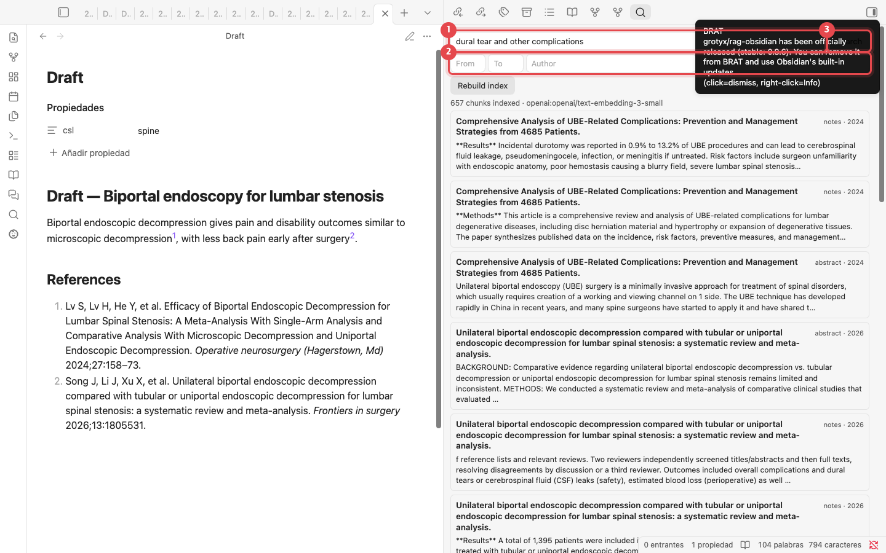

1. Describe lo que buscas, por ejemplo `dural tear and other complications`.
2. Acota los resultados por rango de años, autor o etiqueta.
3. Haz clic en **Search**. Los pasajes coincidentes se listan por artículo; haz clic en uno para abrir su nota.

## 8. Chatear con tu biblioteca

Las respuestas provienen solo de los artículos que has reunido. Los números entre corchetes, como `[1]` y `[3]`, indican de qué artículo procede cada afirmación.

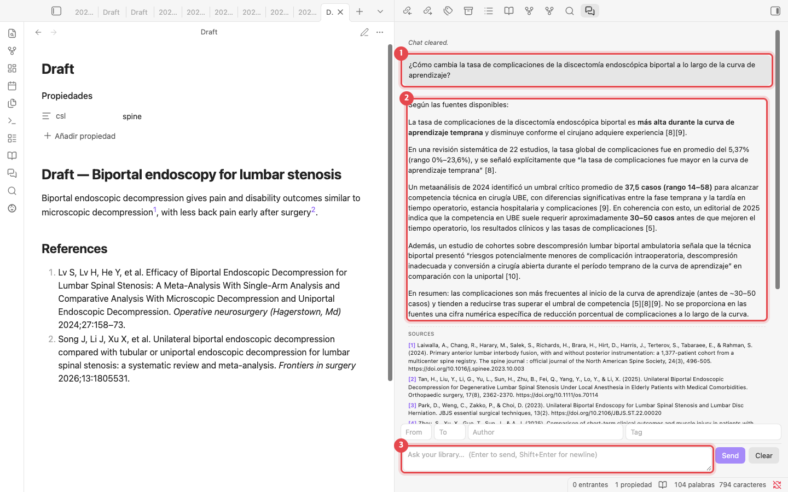

1. Tu pregunta. Puedes preguntar en cualquier idioma.
2. La respuesta. Los números entre corchetes son las fuentes.
3. El cuadro de la pregunta. Pulsa <kbd>Enter</kbd> para enviarla. Los campos de arriba limitan las fuentes por año, autor o etiqueta.

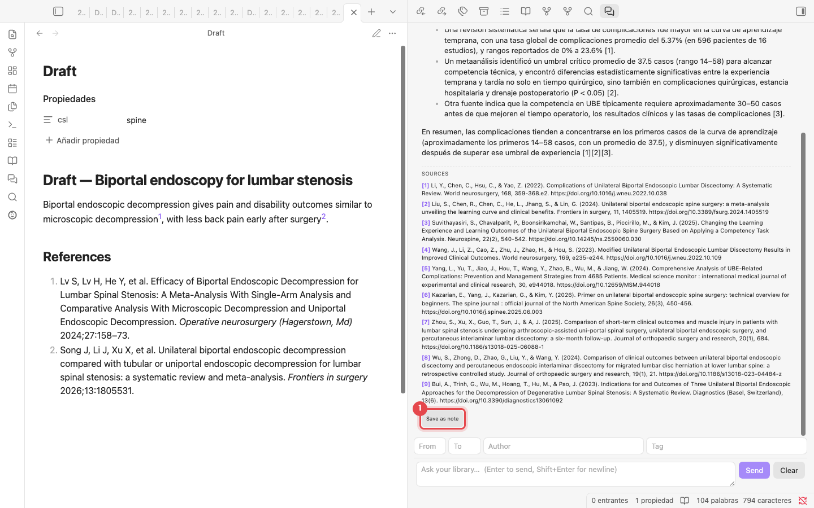

1. **SOURCES** lista los artículos detrás de la respuesta. **Save as note** guarda la respuesta en la carpeta `Chat/` y convierte las fuentes en citas `[@citekey]`.

## 9. Artículos relacionados

Muestra cómo se citan entre sí tus artículos. Haz clic una vez en **Build citation graph** para obtener los datos de citas desde OpenAlex (unos 40 segundos para 56 artículos).

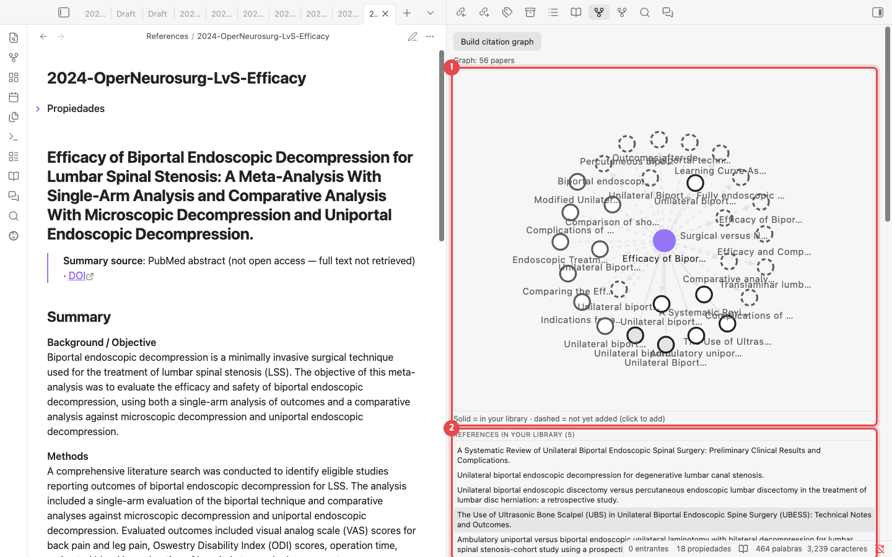

1. **Mapa de citas**: el punto morado es el artículo abierto. Los círculos sólidos son artículos de tu biblioteca; los círculos discontinuos son artículos que aún no tienes. Haz clic en un círculo discontinuo para añadirlo.
2. **Listas**: artículos que este cita, artículos que lo citan, artículos que comparten muchas referencias con él, y artículos que tu biblioteca cita a menudo pero que no contiene.

## 10. Terminar el manuscrito y exportarlo a Word

Todos los comandos están en la paleta de comandos (<kbd>Cmd/Ctrl</kbd>+<kbd>P</kbd>). Escribe "Academic Paper Citation Manager" para listarlos.

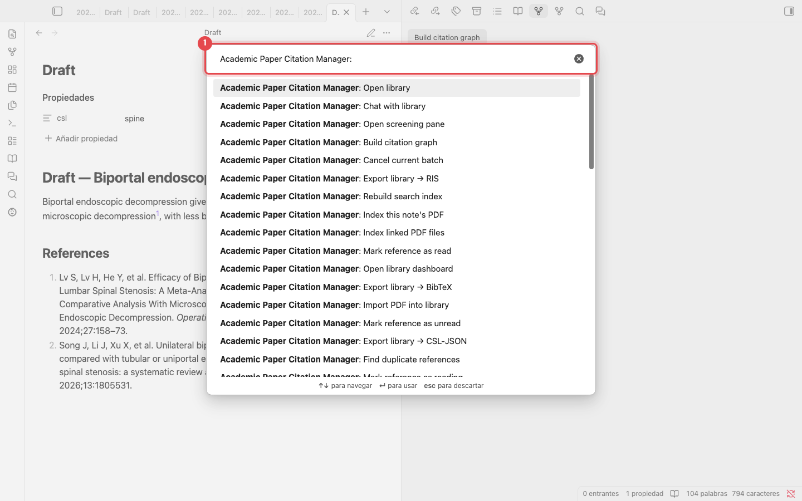

1. Escribe aquí parte del nombre de un comando. Los comandos más usados:

| Comando | Qué hace |
|---|---|
| Update bibliography in current note | Escribe la sección References del manuscrito |
| Compile manuscript | Crea una copia con `[@citekey]` reemplazado por citas formateadas |
| Export manuscript to Word (.docx) | Compila y luego guarda un archivo Word (necesita [Pandoc](https://pandoc.org)) |
| Find unsupported claims | Lista párrafos que hacen una afirmación sin cita |
| Suggest citations for selection | Sugiere artículos para la frase seleccionada |

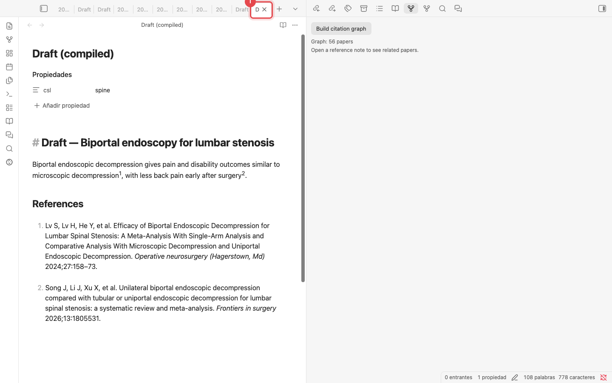

1. **Compile manuscript** deja el original intacto y abre una nota nueva, **Draft (compiled)**. Las citas quedan formateadas y la lista de referencias adjunta, lista para enviarla. Para un archivo Word, ejecuta **Export manuscript to Word (.docx)**.

---

Capturas de pantalla: complemento v0.7.8 en una biblioteca de prueba de 56 artículos. Las respuestas del chat son la salida del modelo sin editar. Los mantenedores regeneran las capturas con `python scripts/manual/capture.py es`.
