# ユーザーガイド — Refwright

[English](en.md) · [한국어](ko.md) · [中文](zh.md) · **日本語** · [Español](es.md) · [Deutsch](de.md) · [Français](fr.md) · [Português](pt.md)

論文を集めるところからWord原稿を書き出すところまで、順を追って説明します。すべてのスクリーンショットは実際にプラグインを操作して撮影したものです。画面の赤い番号は、その下の手順番号と対応しています。

**流れ：** 論文を集める → 読んで整理する → 検索して質問する → 引用する → Wordに書き出す

**目次**

0. [セットアップ](#0-セットアップ)
1. [画面構成](#1-画面構成)
2. [PubMedから論文を追加](#2-pubmedから論文を追加)
3. [DOIまたはPMIDで1本追加](#3-doiまたはpmidで1本追加)
4. [参考文献ノート](#4-参考文献ノート)
5. [ライブラリを見る](#5-ライブラリを見る)
6. [原稿に引用を挿入](#6-原稿に引用を挿入)
7. [セマンティック検索](#7-セマンティック検索)
8. [ライブラリとチャット](#8-ライブラリとチャット)
9. [関連論文](#9-関連論文)
10. [原稿を仕上げてWordに書き出す](#10-原稿を仕上げてwordに書き出す)

---

## 0. セットアップ

**設定 → コミュニティプラグイン → 閲覧** で "Refwright" を検索し、インストールして有効化します。次にAIキーを一度だけ入力します。

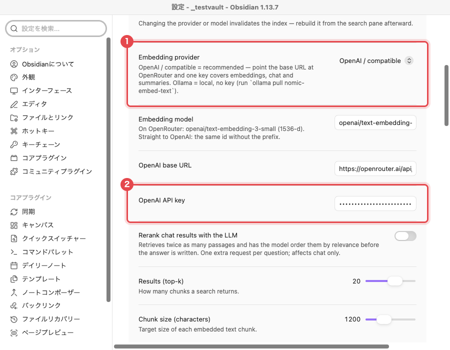

1. **Embedding provider** は初期値の `OpenAI / compatible` のままにします。既定のベースURLはOpenRouterなので、キー1つで検索・チャット・要約すべてをカバーします。
2. **OpenAI API key** にOpenRouterのキーを貼り付けます。キーはOSのキーチェーンに保存され、Vault内のファイルには残りません。

> **引用だけなら鍵は不要です。** 論文の追加、`@` による引用、参考文献リストの生成はAIキーなしで動きます。キーが必要なのは要約・セマンティック検索・チャットだけです。

## 1. 画面構成

左側のリボンに3つのアイコンが追加され、右側にライブラリペインが開きます。

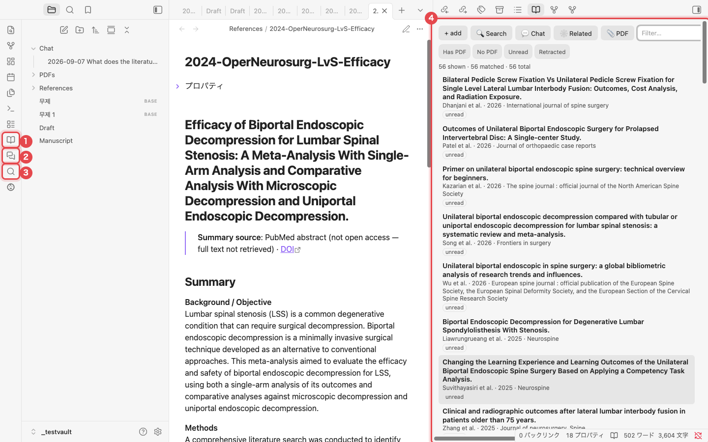

1. **Open library**：論文の一覧を開きます。
2. **Chat with library**：自分の論文を根拠に答えるチャットを開きます。
3. **Search PubMed**：PubMedを検索して論文を追加します。
4. **ライブラリペイン**：論文1本がノート1つに対応します。タイトルをクリックするとそのノートが開きます。

## 2. PubMedから論文を追加

ライブラリを作る一番早い方法です。検索して欲しい論文にチェックを入れると、要約とトピックタグ付きのノートがそれぞれ作られます。

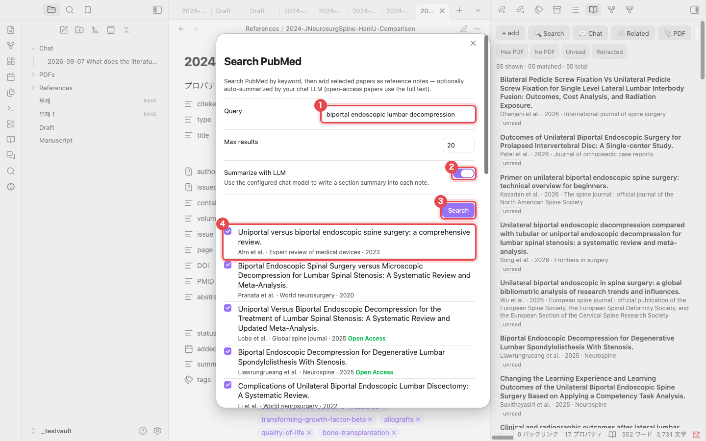

1. **Query** に検索語を入力します。例：`biportal endoscopic lumbar decompression`
2. **Summarize with LLM** をオンにしておくと、各ノートにセクションごとの要約が書き込まれます。オープンアクセスの論文は全文から要約が作られます。
3. **Search** をクリックします。
4. 追加したい論文にチェックを入れます。**Open Access** と表示された論文は全文から要約されます。

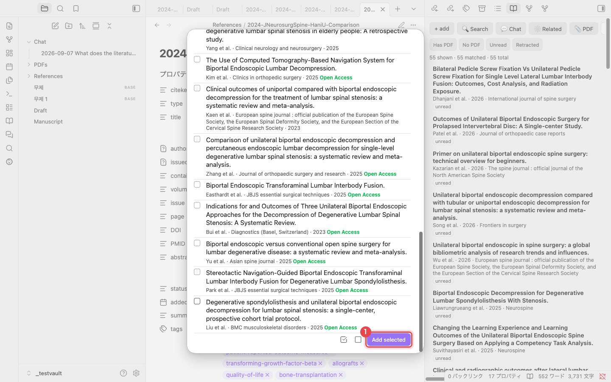

1. 一覧の下にある **Add selected** をクリックします。隣の2つのアイコンは全選択と全解除です。1本あたり10〜20秒ほどかかり、完了すると "Added 1 reference." という通知が出ます。

> **重複は追加されません。** すでにライブラリにある論文はDOI・PMID・タイトルで識別され、再び追加されることはありません。

## 3. DOIまたはPMIDで1本追加

追加したい論文が決まっているときは、その識別子を貼り付けるだけです。ライブラリペインの **+ add** をクリックするか、コマンドパレットで "Add reference by DOI / PMID / arXiv" を実行します。

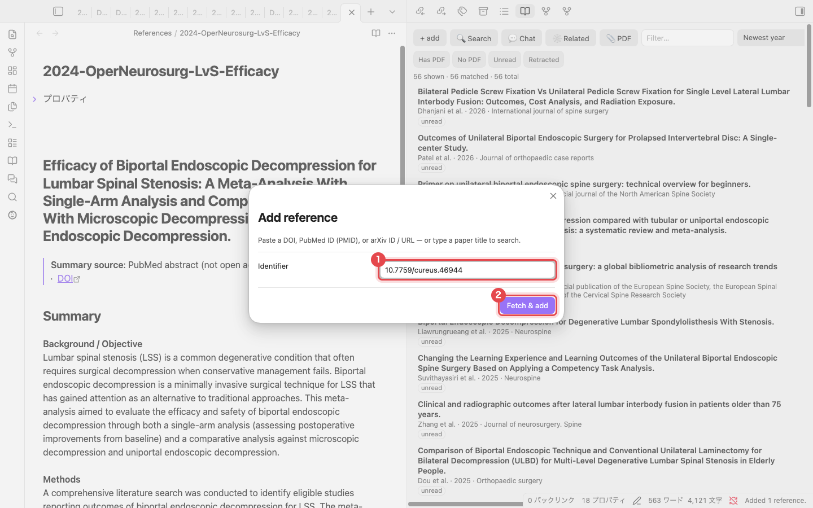

1. DOI（`10.7759/cureus.46944`）、PMID（`38021704`）、arXiv IDのいずれかを入力します。論文タイトルを入力しても検索されます。
2. **Fetch & add** をクリックします。メタデータはCrossrefとPubMedから取得されます。

> **PDFがあるなら** ライブラリペインの **📎 PDF** を使うと、PDFファイルから論文を追加できます。PDF内のDOIを読み取ってメタデータを埋めます。

## 4. 参考文献ノート

論文はそれぞれ `References/` フォルダ内のMarkdownノートとして保存されます。ファイル自体がデータベースなので、Zoteroのような別のプログラムは不要です。

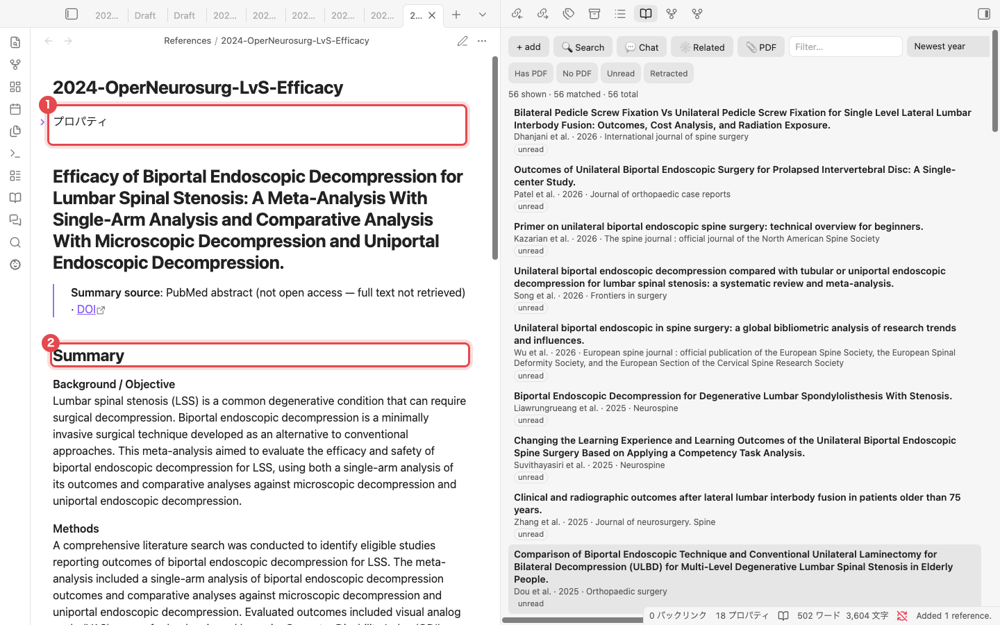

1. **プロパティ**：著者、発行年、雑誌名、DOI、PMID、タグ（MeSH由来）が入っています。引用に使うキー `citekey`（例：`lv2024efficacy`）もここにあります。
2. **Summary**：Background、Methods、Results、Conclusionsの順にまとめた要約です。その下の **Notes** に自分のメモを書きます。

## 5. ライブラリを見る

論文が増えてきたら、ライブラリペインで絞り込みます。

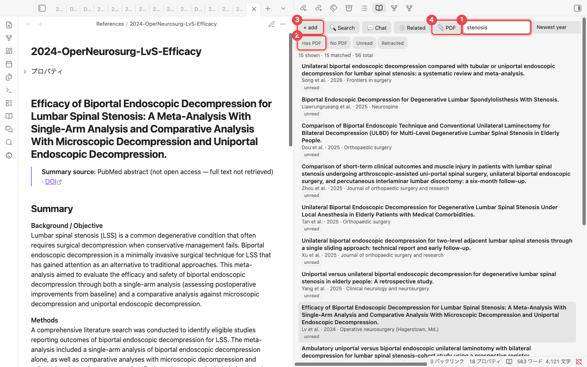

1. **Filter**：タイトル・著者・タグに一致するものを絞り込みます。`stenosis` と入力すると56本中15本が残ります。右側のメニューで並び順（発行年の新しい順など）を変更できます。
2. **クイックフィルタ**：PDFあり、PDFなし、未読、撤回済みの論文だけを表示します。
3. **+ add**：DOI / PMIDのダイアログを開きます（第3節）。
4. **📎 PDF**：PDFファイルから論文を追加します。

## 6. 原稿に引用を挿入

原稿は普通のノートに書きます。引用したい場所に `@` を入力します。

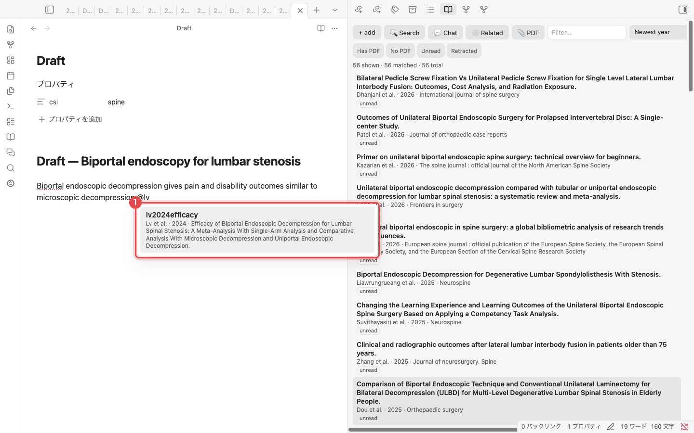

1. `@` の後に著者名やタイトルの一部を入力すると、該当する論文が候補に出ます。<kbd>Enter</kbd> を押すと `[@lv2024efficacy]` が挿入されます。

### 参考文献リストを作る

ノートのプロパティに雑誌スタイルを設定し（`csl: spine`）、<kbd>Cmd/Ctrl</kbd>+<kbd>P</kbd> → **Update bibliography in current note** を実行します。

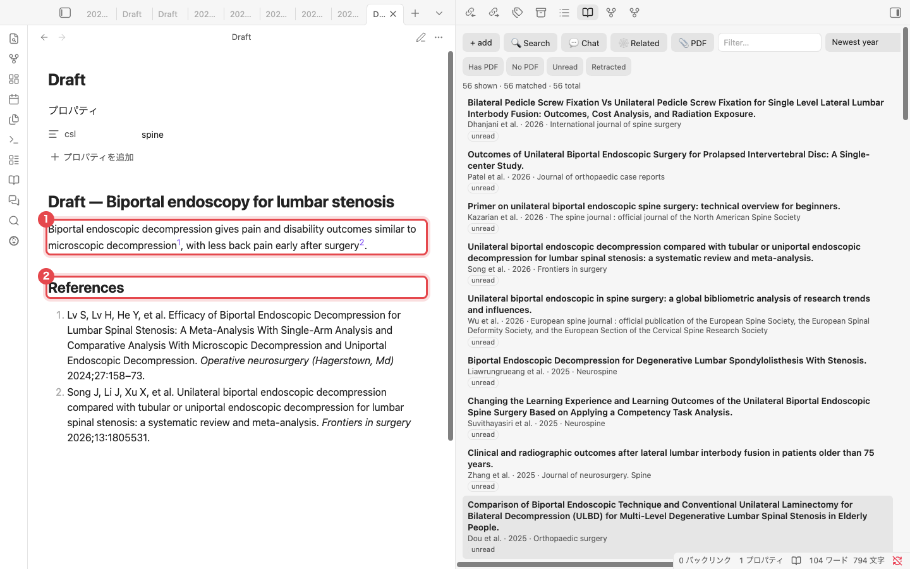

1. 閲覧モードでは、各 `[@citekey]` が雑誌のスタイル（ここでは上付き数字）で表示されます。
2. ノートの末尾に雑誌の形式で **References** セクションが書き込まれます。引用を追加・削除したら、コマンドを再実行して更新します。

> **雑誌スタイル**：`spine`、`apa`、`american-medical-association`、`elsevier-vancouver`、`springer-basic-brackets` は内蔵されています。それ以外の [CSLスタイルリポジトリ](https://github.com/citation-style-language/styles) のスタイルID（`vancouver` や `nature` など）は、初めて使うときに自動でダウンロードされます。IDがわからないときは **Choose citation style…** コマンドで雑誌名を入力します。

## 7. セマンティック検索

言葉が違っていても、意味が近い箇所を見つけます。ライブラリペインの **Search** から開きます。最初に一度だけ **Rebuild index** をクリックします（論文50本ほどなら1分未満）。

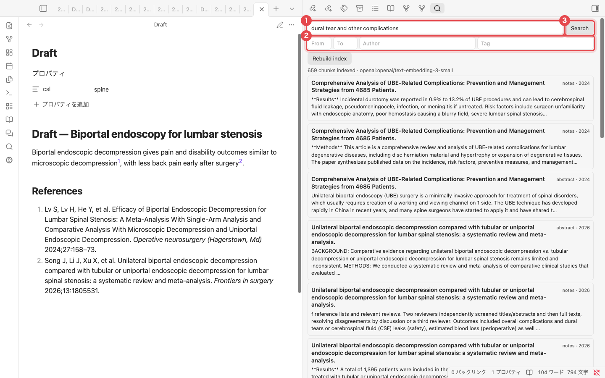

1. 探したい内容を文章で入力します。例：`dural tear and other complications`
2. 発行年の範囲、著者、タグで結果を絞り込みます。
3. **Search** をクリックします。一致した箇所が論文ごとに並び、クリックするとそのノートが開きます。

## 8. ライブラリとチャット

回答は自分が集めた論文だけを根拠にします。文中の `[1]` や `[3]` のような角括弧の番号が、どの論文からの記述かを示します。

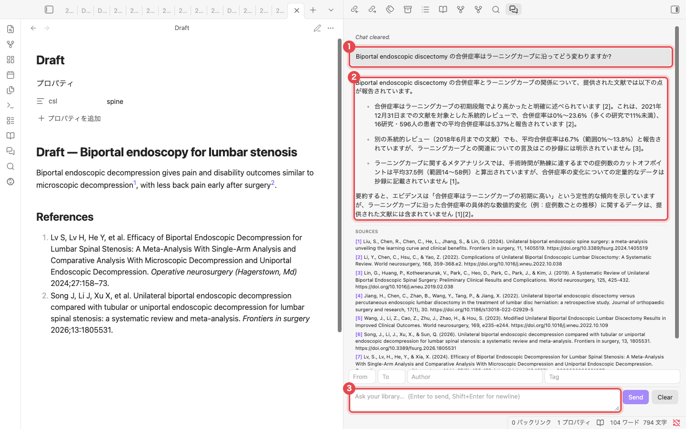

1. 自分の質問です。どの言語で聞いても構いません。
2. 回答です。角括弧の番号が出典です。
3. 質問入力欄です。<kbd>Enter</kbd> で送信します。上にあるフィールドで、発行年・著者・タグにより出典の範囲を絞れます。

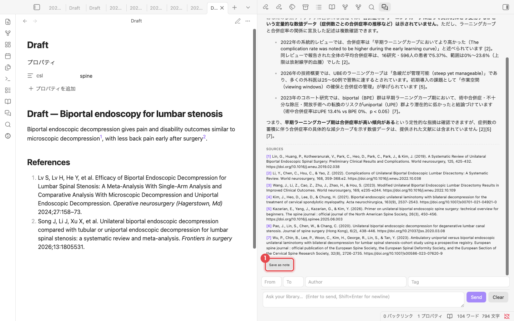

1. **SOURCES** に回答の根拠となった論文が並びます。**Save as note** を押すと、回答が `Chat/` フォルダのノートとして保存され、出典が `[@citekey]` の引用に変わります。

## 9. 関連論文

自分の論文同士がどう引用し合っているかを示します。最初に一度 **Build citation graph** をクリックすると、OpenAlexから引用データを取得します（56本で約40秒）。

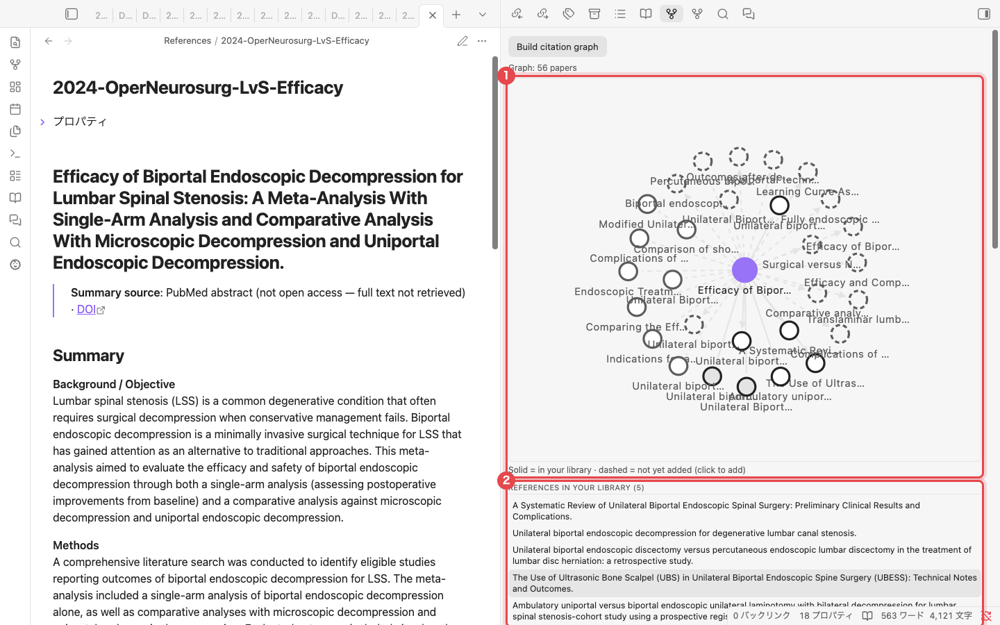

1. **引用マップ**：紫色の点が今開いている論文です。実線の円はライブラリにある論文、破線の円はまだ持っていない論文です。破線の円をクリックすると追加できます。
2. **一覧**：この論文が引用している論文、この論文を引用している論文、参考文献を多く共有している論文、そしてライブラリでよく引用されているのにまだ収録していない論文の順に並びます。

## 10. 原稿を仕上げてWordに書き出す

すべてのコマンドはコマンドパレット（<kbd>Cmd/Ctrl</kbd>+<kbd>P</kbd>）から使えます。"Refwright" と入力すると一覧が出ます。

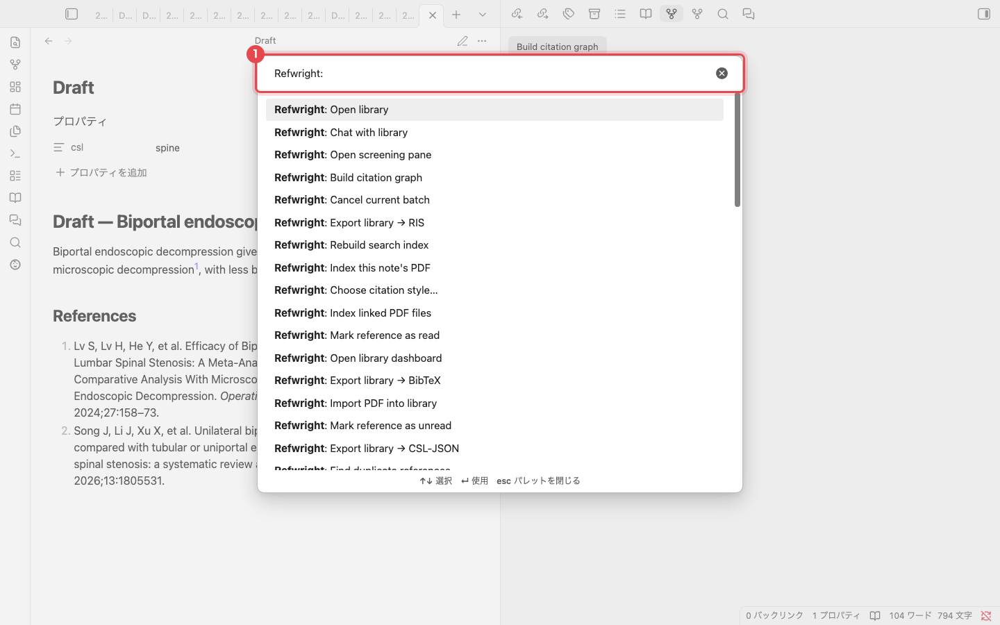

1. ここにコマンド名の一部を入力します。よく使うコマンドは次のとおりです。

| コマンド | 内容 |
|---|---|
| Update bibliography in current note | 原稿末尾にReferencesセクションを書き込む |
| Compile manuscript | `[@citekey]` を整形済みの引用に置き換えたコピーを作る |
| Export manuscript to Word (.docx) | コンパイルしてからWordファイルとして保存する（[Pandoc](https://pandoc.org)が必要） |
| Find unsupported claims | 引用のない主張を含む段落を一覧にする |
| Suggest citations for selection | 選択した文に合う論文を提案する |

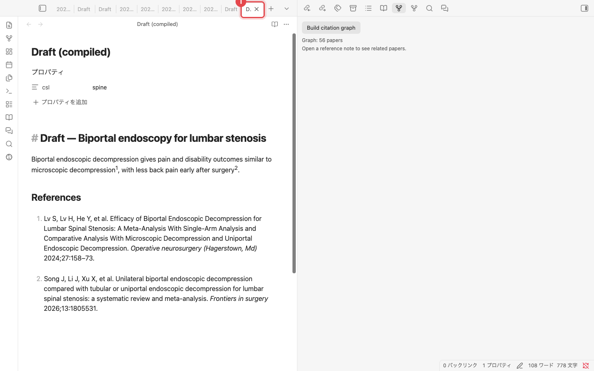

1. **Compile manuscript** は元のノートには手を加えず、新しく **Draft (compiled)** ノートを開きます。引用は整形済みで、参考文献リストも付いているのでそのまま投稿できます。Wordファイルが必要な場合は **Export manuscript to Word (.docx)** を実行します。

---

スクリーンショット：プラグイン v0.7.8、テスト用ライブラリの論文56本。チャットの回答はモデルの出力をそのまま掲載しています。メンテナーは `python scripts/manual/capture.py ja` でスクリーンショットを再生成します。
