# 사용 설명서 — Refwright

[English](en.md) · **한국어** · [中文](zh.md) · [日本語](ja.md) · [Español](es.md)

논문을 모으는 것부터 Word 원고로 내보내기까지 순서대로 설명합니다. 모든 화면은 실제
플러그인을 조작하면서 찍었습니다. 화면의 빨간 번호는 그 아래 설명의 번호와 같습니다.

**흐름:** 논문 모으기 → 읽고 정리 → 찾고 묻기 → 인용하기 → Word로 내보내기

**목차**

0. [시작 설정](#0-시작-설정)
1. [화면 구성](#1-화면-구성)
2. [PubMed로 논문 추가](#2-pubmed로-논문-추가)
3. [DOI·PMID로 한 편 추가](#3-doipmid로-한-편-추가)
4. [레퍼런스 노트](#4-레퍼런스-노트)
5. [라이브러리에서 찾기](#5-라이브러리에서-찾기)
6. [원고에 인용하기](#6-원고에-인용하기)
7. [의미 검색](#7-의미-검색)
8. [라이브러리와 대화](#8-라이브러리와-대화)
9. [관련 논문](#9-관련-논문)
10. [원고 마무리와 Word 내보내기](#10-원고-마무리와-word-내보내기)

---

## 0. 시작 설정

**설정 → 커뮤니티 플러그인 → 탐색**에서 "Refwright"를 검색해
설치하고 활성화합니다. 그다음 AI 키를 한 번만 넣습니다.

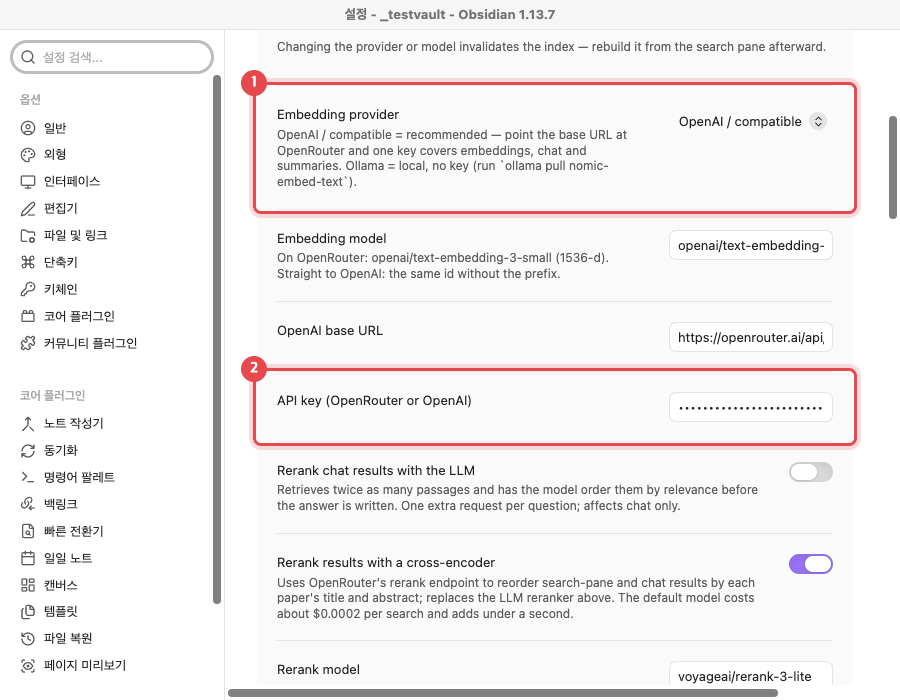

1. **Embedding provider**는 기본값 `OpenAI / compatible` 그대로 둡니다. 기본 주소가
   OpenRouter라서 키 하나로 검색·채팅·요약이 모두 됩니다.
2. **OpenAI API key** 칸에 OpenRouter 키를 붙여 넣습니다. 키는 운영체제 키체인에
   저장되고 볼트 파일에는 남지 않습니다.

> **인용만 쓴다면 키가 필요 없습니다.** 논문 추가, `@` 인용, 참고문헌 생성은 AI 키 없이
> 동작합니다. 키는 요약·의미 검색·채팅에만 씁니다.

## 1. 화면 구성

왼쪽 리본에 아이콘 세 개가 생기고, 오른쪽 사이드바에 라이브러리 창이 열립니다.

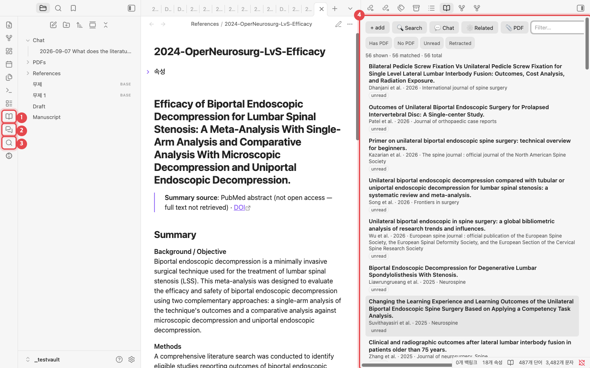

1. **Open library**: 모아 둔 논문 목록을 엽니다.
2. **Chat with library**: 내 논문을 근거로 답하는 채팅 창을 엽니다.
3. **Search PubMed**: PubMed를 검색해서 논문을 추가합니다.
4. **라이브러리 창**: 논문 하나가 노트 하나입니다. 제목을 누르면 그 노트가 열립니다.

## 2. PubMed로 논문 추가

가장 빠른 방법입니다. 검색하고 원하는 논문에 체크하면 요약과 주제 태그가 달린 노트가
만들어집니다.

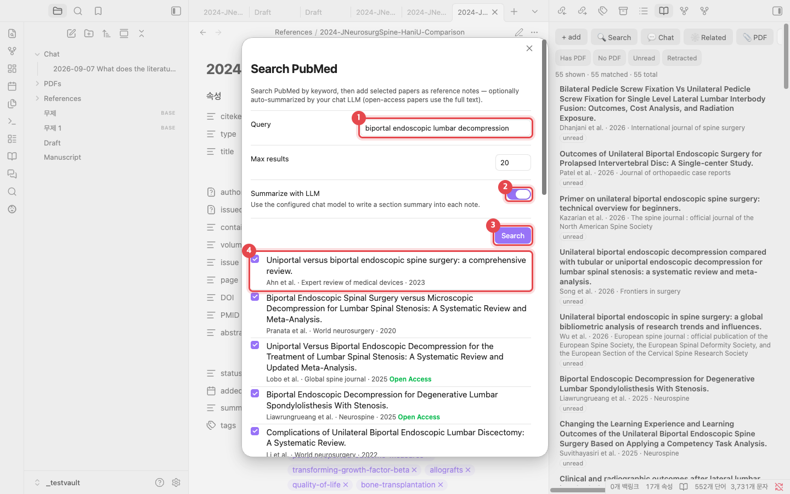

1. **Query**에 검색어를 넣습니다. 예: `biportal endoscopic lumbar decompression`
2. **Summarize with LLM**을 켜 두면 노트마다 섹션별 요약과 한국어 요약을 적어 줍니다.
3. **Search**를 누릅니다.
4. 추가할 논문에 체크합니다. **Open Access** 표시가 있는 논문은 전문을 읽고 요약합니다.

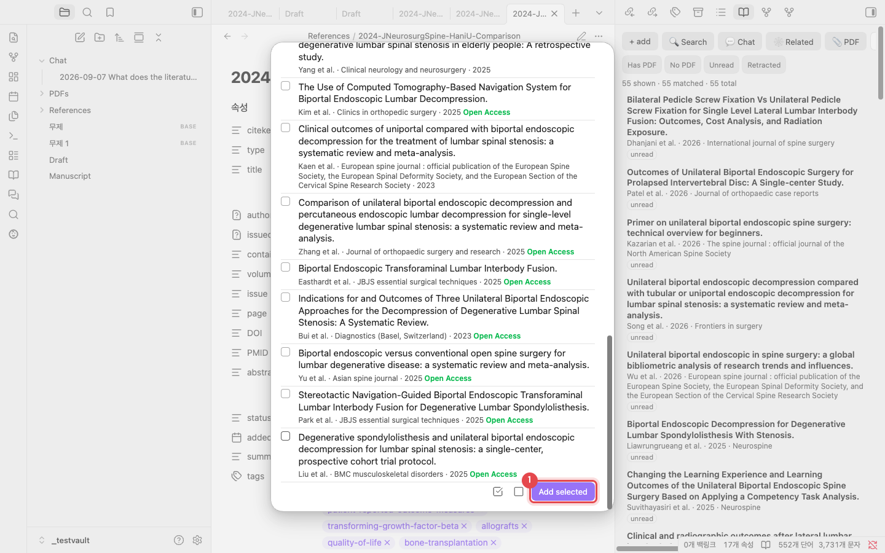

1. 목록 맨 아래 **Add selected**를 누릅니다. 옆의 두 아이콘은 전체 선택과 전체
   해제입니다. 한 편에 10–20초쯤 걸리고, 끝나면 "Added 1 reference." 알림이 뜹니다.

> **중복은 걸러집니다.** 이미 있는 논문은 DOI·PMID·제목으로 알아보고 다시 만들지 않습니다.

## 3. DOI·PMID로 한 편 추가

추가할 논문이 정해져 있으면 식별자만 붙여 넣습니다. 라이브러리 창의 **+ add**를 누르거나,
명령 팔레트에서 "Add reference by DOI / PMID / arXiv"를 실행합니다.

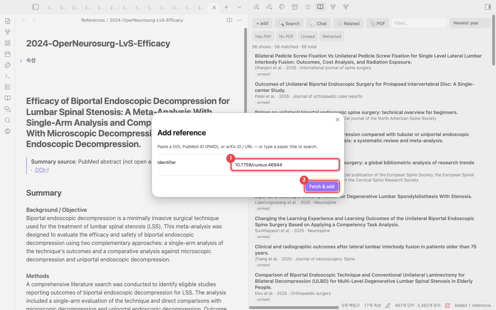

1. DOI(`10.7759/cureus.46944`), PMID(`38021704`), arXiv ID 중 하나를 넣습니다. 논문
   제목을 넣으면 검색합니다.
2. **Fetch & add**를 누르면 Crossref·PubMed에서 서지 정보를 가져와 노트를 만듭니다.

> **PDF가 있다면** 라이브러리 창의 **📎 PDF** 버튼으로 PDF에서 바로 추가합니다. PDF 안의
> DOI를 찾아 서지 정보를 채웁니다.

## 4. 레퍼런스 노트

논문은 `References/` 폴더에 마크다운 노트로 저장됩니다. 파일이 곧 데이터베이스라서 Zotero
같은 별도 프로그램이 필요 없습니다.

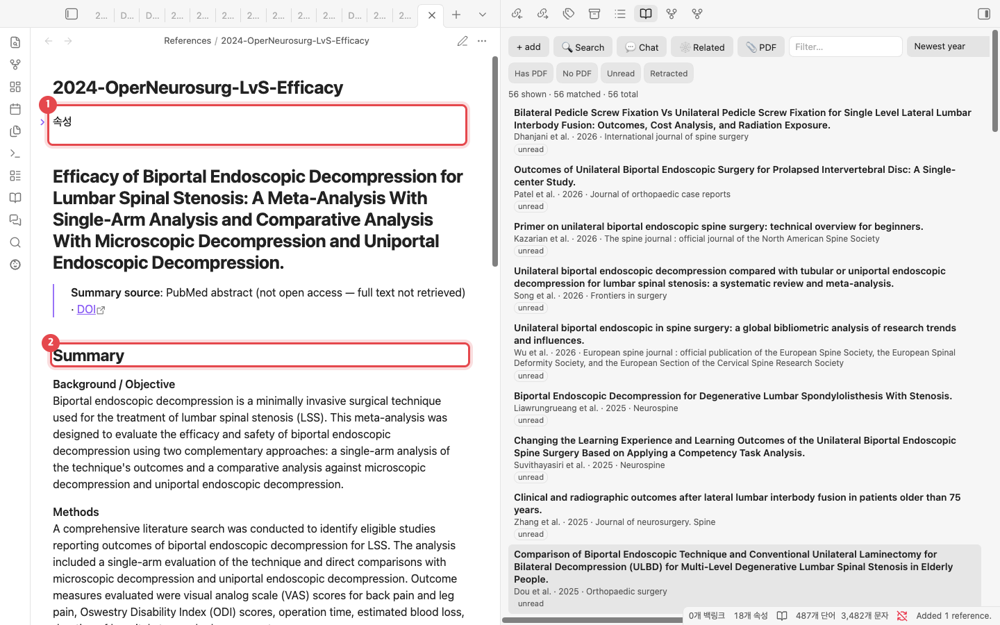

1. **속성**: 저자, 연도, 저널, DOI, PMID, 태그(MeSH 기반)가 들어 있습니다. 인용할 때 쓰는
   키 `citekey`(예: `lv2024efficacy`)도 여기에 있습니다.
2. **Summary**: Background, Methods, Results, Conclusions 순서의 요약과 한국어 요약입니다.
   그 아래 **Notes**에 내 메모를 적습니다.

## 5. 라이브러리에서 찾기

논문이 많아지면 라이브러리 창에서 걸러 봅니다.

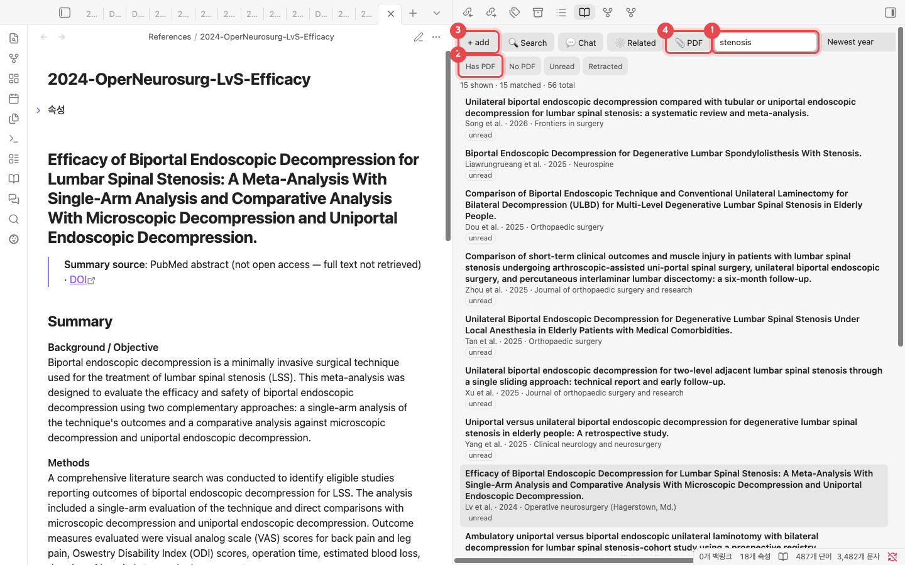

1. **Filter**: 제목·저자·태그로 거릅니다. `stenosis`를 넣으면 56편 중 15편이 남습니다.
   오른쪽 메뉴에서 정렬(최신 연도 순 등)을 바꿉니다.
2. **빠른 필터**: PDF 있음·없음, 안 읽음, 철회된 논문(Retracted)만 봅니다.
3. **+ add**: DOI·PMID 추가 창을 엽니다(3장).
4. **📎 PDF**: PDF 파일에서 논문을 추가합니다.

## 6. 원고에 인용하기

원고는 평범한 노트에 씁니다. 인용할 자리에 `@`를 칩니다.

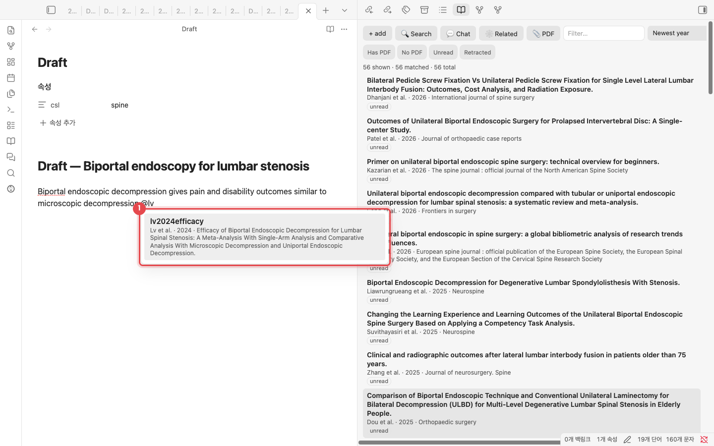

1. `@` 뒤에 저자 이름이나 제목 일부를 치면 후보가 뜹니다. <kbd>Enter</kbd>를 누르면
   `[@lv2024efficacy]`가 들어갑니다.

### 참고문헌 만들기

노트 속성에 저널 스타일을 적고(`csl: spine`), <kbd>Cmd/Ctrl</kbd>+<kbd>P</kbd> →
**Update bibliography in current note**를 실행합니다.

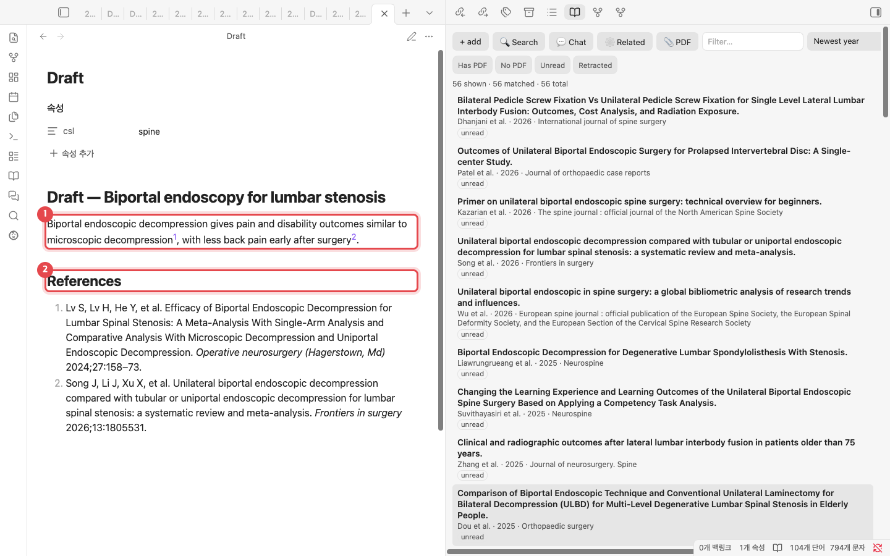

1. 읽기 화면에서 `[@citekey]`가 저널 형식(여기서는 윗첨자 번호)으로 보입니다.
2. 노트 끝에 **References**가 저널 형식으로 만들어집니다. 인용을 더하거나 뺀 뒤 다시
   실행하면 갱신됩니다.

> **저널 스타일**: `spine`, `apa`, `american-medical-association`, `elsevier-vancouver`,
> `springer-basic-brackets`는 내장되어 있습니다. 그 밖에는
> [CSL 스타일 저장소](https://github.com/citation-style-language/styles)의 ID(예: `vancouver`,
> `nature`)를 적으면 처음 쓸 때 내려받습니다. ID를 모르면 **Choose citation style…** 명령에서
> 저널 이름으로 찾습니다.

## 7. 의미 검색

단어가 달라도 뜻이 비슷한 문단을 찾습니다. 라이브러리 창의 **Search**로 엽니다. 처음 한 번
**Rebuild index**를 눌러 인덱스를 만듭니다(논문 50편 정도면 1분 이내).

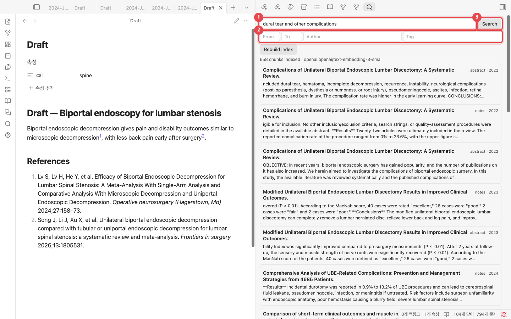

1. 찾을 내용을 문장으로 적습니다. 예: `dural tear and other complications`
2. 연도 범위, 저자, 태그로 범위를 좁힙니다.
3. **Search**를 누르면 관련 문단이 논문별로 나옵니다. 문단을 누르면 그 노트가 열립니다.

## 8. 라이브러리와 대화

내가 모은 논문만 근거로 답합니다. 문장에 붙은 `[1]`, `[3]` 같은 번호가 어느 논문에서
왔는지 알려 줍니다.

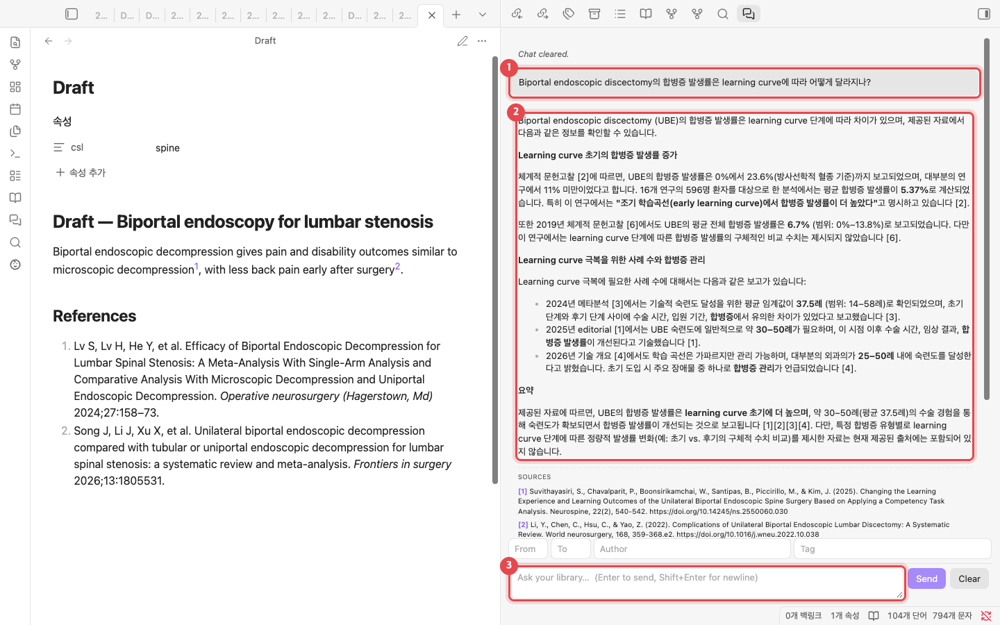

1. 질문입니다. 한국어로 물어도 됩니다.
2. 답변입니다. 대괄호 번호가 출처입니다.
3. 질문 입력란입니다. <kbd>Enter</kbd>로 보내고, 위의 칸에서 연도·저자·태그로 근거 범위를
   정합니다.

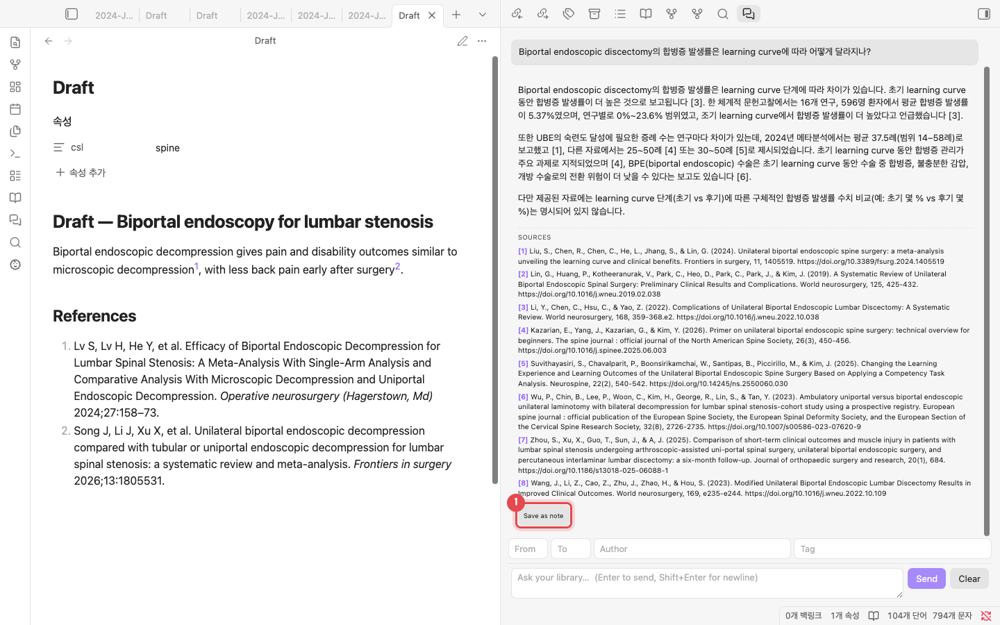

1. **SOURCES**에 근거 논문이 나옵니다. **Save as note**를 누르면 답변이 `Chat/` 폴더에
   노트로 저장되고, 출처는 `[@citekey]` 인용으로 바뀝니다.

## 9. 관련 논문

논문끼리 인용하는 관계를 보여 줍니다. 처음 한 번 **Build citation graph**를 누르면
OpenAlex에서 인용 정보를 가져옵니다(56편에 약 40초).

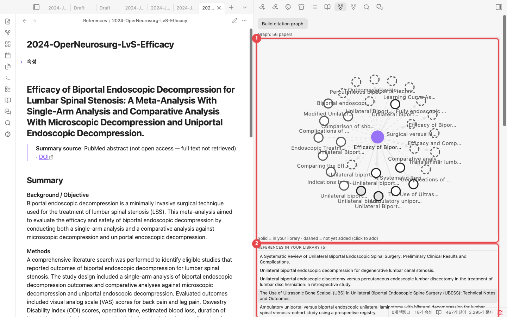

1. **인용 지도**: 보라색 점이 지금 연 논문입니다. 실선 원은 내 라이브러리에 있는 논문,
   점선 원은 아직 없는 논문입니다. 점선 원을 누르면 바로 추가합니다.
2. **목록**: 이 논문이 인용한 논문, 이 논문을 인용한 논문, 참고문헌을 많이 공유하는 논문,
   내 라이브러리가 자주 인용하지만 빠진 논문 순서로 나옵니다.

## 10. 원고 마무리와 Word 내보내기

모든 명령은 명령 팔레트(<kbd>Cmd/Ctrl</kbd>+<kbd>P</kbd>)에서 "Academic Paper Citation
Manager"를 치면 모아서 볼 수 있습니다.

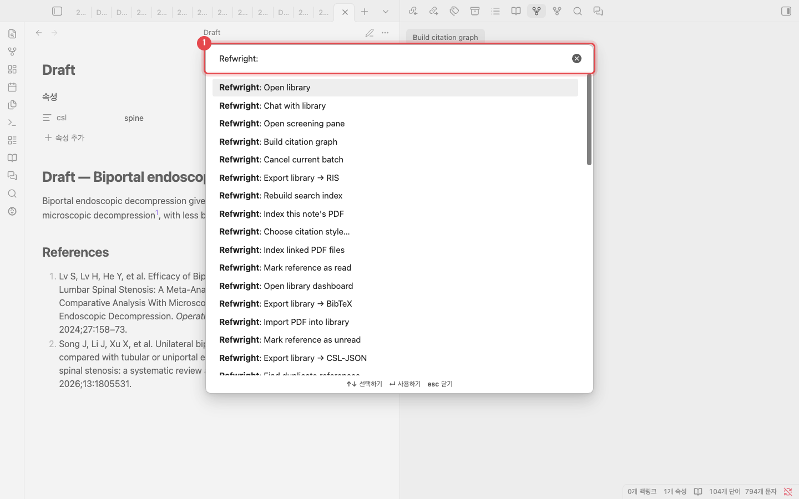

1. 여기에 명령 이름 일부를 칩니다. 자주 쓰는 명령은 다음과 같습니다.

| 명령 | 하는 일 |
|---|---|
| Update bibliography in current note | 원고 끝에 References 만들기 |
| Compile manuscript | `[@citekey]`를 저널 형식 인용으로 바꾼 사본 만들기 |
| Export manuscript to Word (.docx) | 컴파일한 뒤 Word 파일로 저장([Pandoc](https://pandoc.org) 필요) |
| Find unsupported claims | 인용 없이 주장하는 문단 찾기 |
| Suggest citations for selection | 선택한 문장에 맞는 논문 추천 |

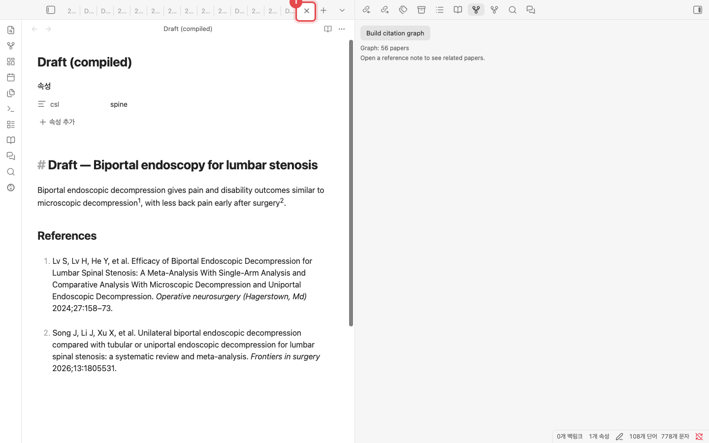

1. **Compile manuscript**는 원본을 그대로 두고 **Draft (compiled)** 노트를 새로 엽니다.
   인용이 저널 형식으로 바뀌고 참고문헌이 붙어 있어 그대로 투고 원고로 씁니다. Word
   파일이 필요하면 **Export manuscript to Word (.docx)**를 실행합니다.

---

화면: 플러그인 v0.7.8, 논문 56편 테스트 볼트. 채팅 답변은 모델 출력 그대로입니다.
관리자는 `python scripts/manual/capture.py ko`로 화면을 다시 찍습니다.
