# 用户指南 — Refwright

[English](en.md) · [한국어](ko.md) · **中文** · [日本語](ja.md) · [Español](es.md) · [Deutsch](de.md) · [Français](fr.md) · [Português](pt.md)

从收集论文到导出 Word 原稿，本指南按顺序说明整个流程。所有截图均来自实际操作的插件。截图中的红色数字与下方步骤编号一致。

**流程：** 收集论文 → 阅读整理 → 检索提问 → 插入引用 → 导出为 Word

**目录**

0. [设置](#0-设置)
1. [界面总览](#1-界面总览)
2. [从 PubMed 添加论文](#2-从-pubmed-添加论文)
3. [用 DOI 或 PMID 添加一篇论文](#3-用-doi-或-pmid-添加一篇论文)
4. [参考文献笔记](#4-参考文献笔记)
5. [浏览文献库](#5-浏览文献库)
6. [在原稿中插入引用](#6-在原稿中插入引用)
7. [语义搜索](#7-语义搜索)
8. [与文献库对话](#8-与文献库对话)
9. [相关论文](#9-相关论文)
10. [完成原稿并导出为 Word](#10-完成原稿并导出为-word)

---

## 0. 设置

在 **设置 → 第三方插件 → 浏览** 中搜索 "Refwright"，安装并启用。然后输入一次 AI 密钥。

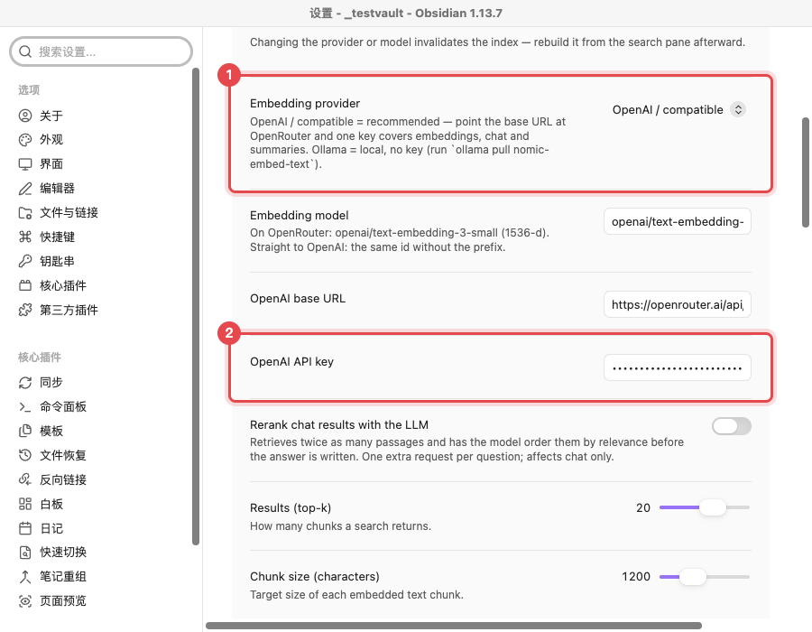

1. **Embedding provider** 保持默认值 `OpenAI / compatible` 即可。默认地址是 OpenRouter，一个密钥即可覆盖搜索、聊天和摘要功能。
2. 将 OpenRouter 密钥粘贴到 **OpenAI API key** 中。密钥保存在系统密钥链中，不会写入库文件。

> **仅做引用无需密钥。** 添加论文、`@` 引用和生成参考文献都不需要 AI 密钥。密钥仅用于摘要、语义搜索和聊天。

## 1. 界面总览

插件会在左侧功能区添加三个图标，并在右侧打开文献库面板。

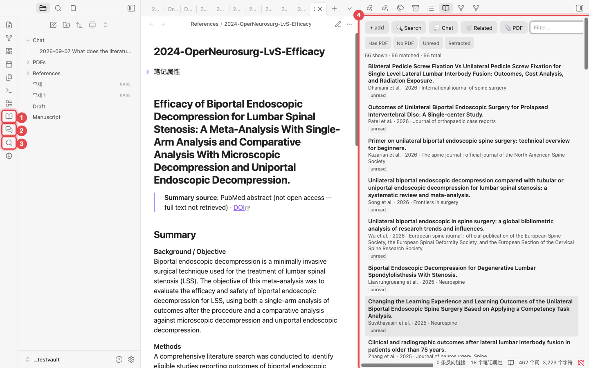

1. **Open library**：打开你的论文列表。
2. **Chat with library**：打开基于你自己论文回答问题的聊天窗口。
3. **Search PubMed**：搜索 PubMed 并添加论文。
4. **文献库面板**：每篇论文对应一个笔记。点击标题即可打开该笔记。

## 2. 从 PubMed 添加论文

这是建立文献库最快的方法。搜索后勾选想要的论文，每篇都会生成一个带摘要和主题标签的笔记。

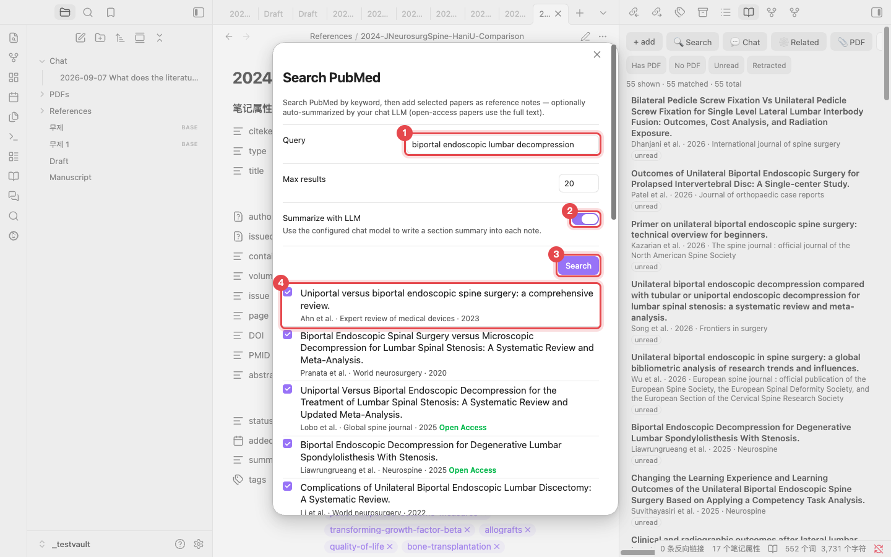

1. 在 **Query** 中输入搜索词，例如 `biportal endoscopic lumbar decompression`。
2. 保持 **Summarize with LLM** 开启，笔记中会写入按小节整理的摘要。对于开放获取的论文，摘要基于全文撰写。
3. 点击 **Search**。
4. 勾选要添加的论文。标有 **Open Access** 的论文会基于全文生成摘要。

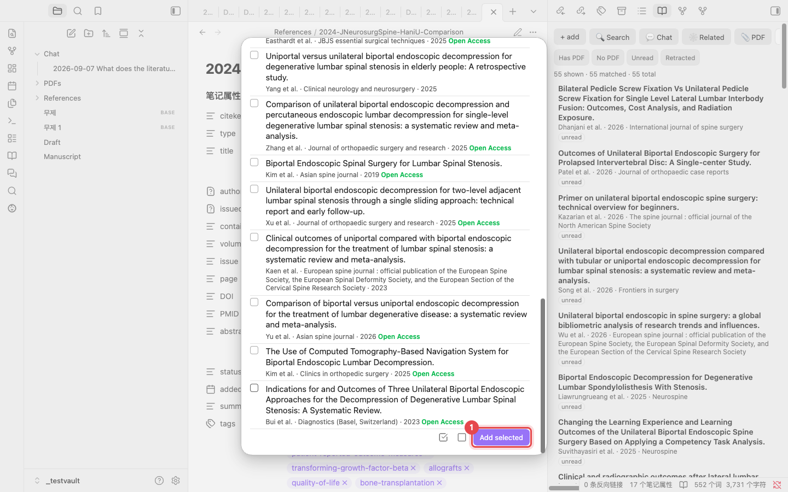

1. 点击列表底部的 **Add selected**。旁边两个图标分别是全选和清除全选。每篇论文约需 10–20 秒，完成后会出现 "Added 1 reference." 提示。

> **不会重复添加。** 库中已有的论文会通过 DOI、PMID 或标题识别出来，不会重复添加。

## 3. 用 DOI 或 PMID 添加一篇论文

如果已经知道要添加的论文，直接粘贴其标识符即可。点击文献库面板中的 **+ add**，或在命令面板中运行 "Add reference by DOI / PMID / arXiv"。

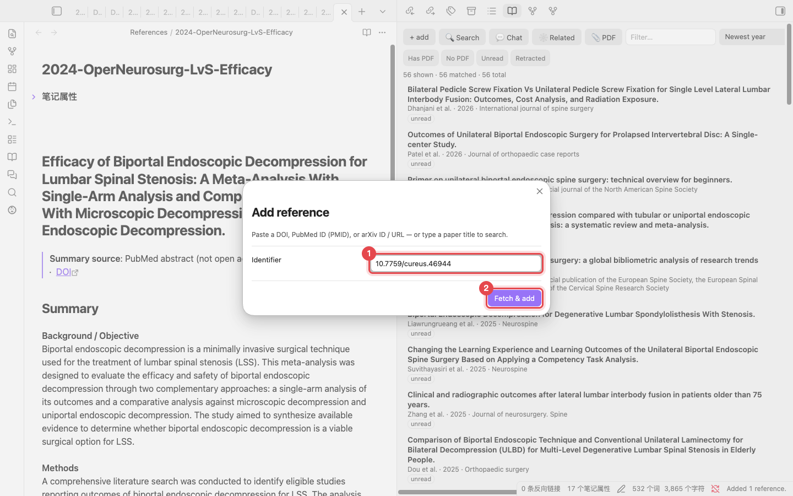

1. 输入 DOI（`10.7759/cureus.46944`）、PMID（`38021704`）或 arXiv ID。输入论文标题也可以，插件会据此搜索。
2. 点击 **Fetch & add**。元数据来自 Crossref 和 PubMed。

> **有 PDF 吗？** 在文献库面板中使用 **📎 PDF** 从 PDF 文件添加论文。插件会读取 PDF 中的 DOI 来填充元数据。

## 4. 参考文献笔记

每篇论文都保存为 `References/` 文件夹下的一个 Markdown 笔记。文件本身就是数据库，因此不需要 Zotero 之类的独立程序。

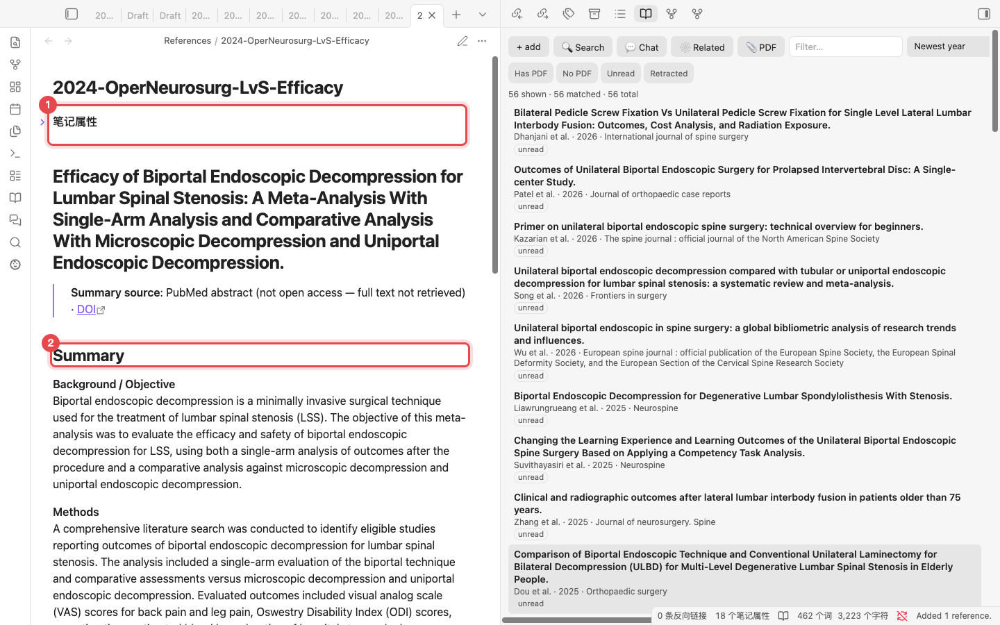

1. **笔记属性**：作者、年份、期刊、DOI、PMID 和标签（来自 MeSH）。用于引用的键 `citekey`（例如 `lv2024efficacy`）也在这里。
2. **Summary**：按 Background、Methods、Results、Conclusions 顺序整理的摘要。可在下方的 **Notes** 中写自己的笔记。

## 5. 浏览文献库

随着论文增多，可在文献库面板中筛选。

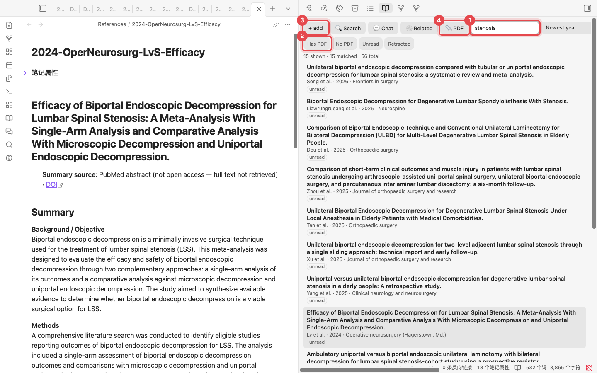

1. **Filter**：匹配标题、作者和标签。输入 `stenosis` 后，56 篇论文中会留下 15 篇。右侧菜单可更改排序方式（例如按年份从新到旧）。
2. **快速筛选**：只看有 PDF、没有 PDF、未读或已撤稿的论文。
3. **+ add**：打开 DOI / PMID 对话框（见第 3 节）。
4. **📎 PDF**：从 PDF 文件添加论文。

## 6. 在原稿中插入引用

在普通笔记中撰写原稿。在需要引用的位置输入 `@`。

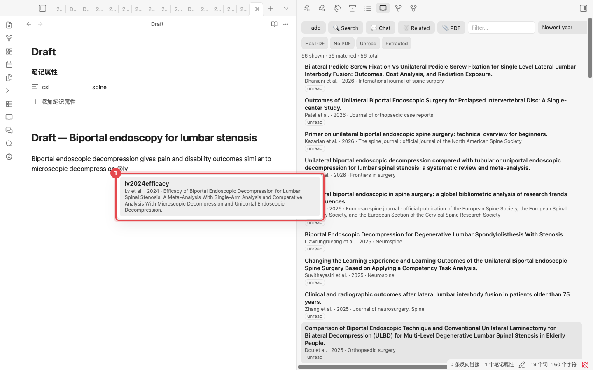

1. 输入 `@` 后，接着输入作者姓名或标题的一部分即可看到匹配的论文。按 <kbd>Enter</kbd> 插入 `[@lv2024efficacy]`。

### 生成参考文献列表

在笔记属性中填写期刊样式（`csl: spine`），然后运行 <kbd>Cmd/Ctrl</kbd>+<kbd>P</kbd> → **Update bibliography in current note**。

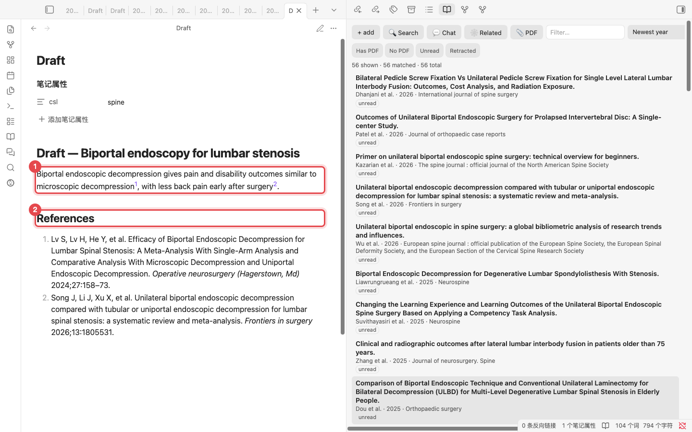

1. 在阅读视图中，每个 `[@citekey]` 都会按期刊样式显示（此处为上标数字）。
2. 笔记末尾会按期刊格式写入 **References** 部分。增删引用后重新运行命令即可更新。

> **期刊样式**：`spine`、`apa`、`american-medical-association`、`elsevier-vancouver` 和 `springer-basic-brackets` 已内置。[CSL 样式仓库](https://github.com/citation-style-language/styles)中的其他样式 ID（例如 `vancouver` 或 `nature`）会在首次使用时自动下载。不知道 ID？运行 **Choose citation style…** 并输入期刊名称即可。

## 7. 语义搜索

即使用词不同，也能找到含义相近的段落。在文献库面板中点击 **Search** 打开。首次使用先点击一次 **Rebuild index**（约 50 篇论文不到一分钟）。

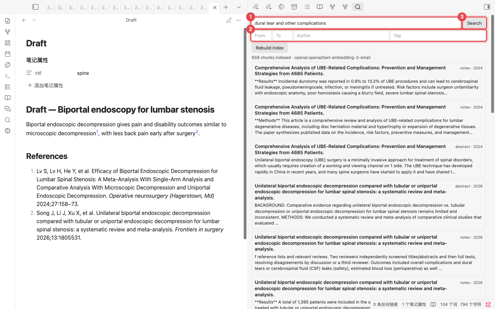

1. 用一句话描述要找的内容，例如 `dural tear and other complications`。
2. 用年份范围、作者或标签缩小结果范围。
3. 点击 **Search**。匹配的段落按论文列出，点击即可打开对应笔记。

## 8. 与文献库对话

回答只基于你收集的论文。句子中的方括号数字，例如 `[1]` 和 `[3]`，标明该说法来自哪篇论文。

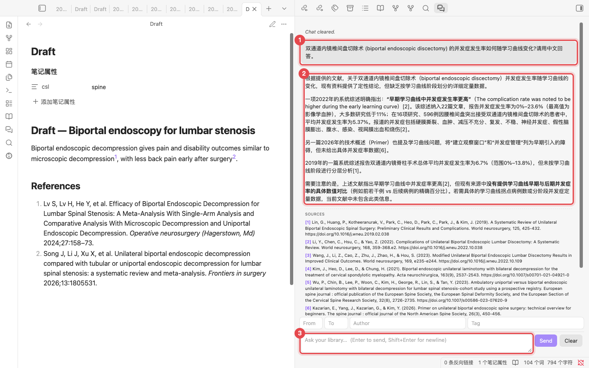

1. 你的问题。可以用任意语言提问。
2. 回答内容。方括号数字即出处。
3. 提问输入框。按 <kbd>Enter</kbd> 发送。上方的字段可按年份、作者或标签限定来源范围。

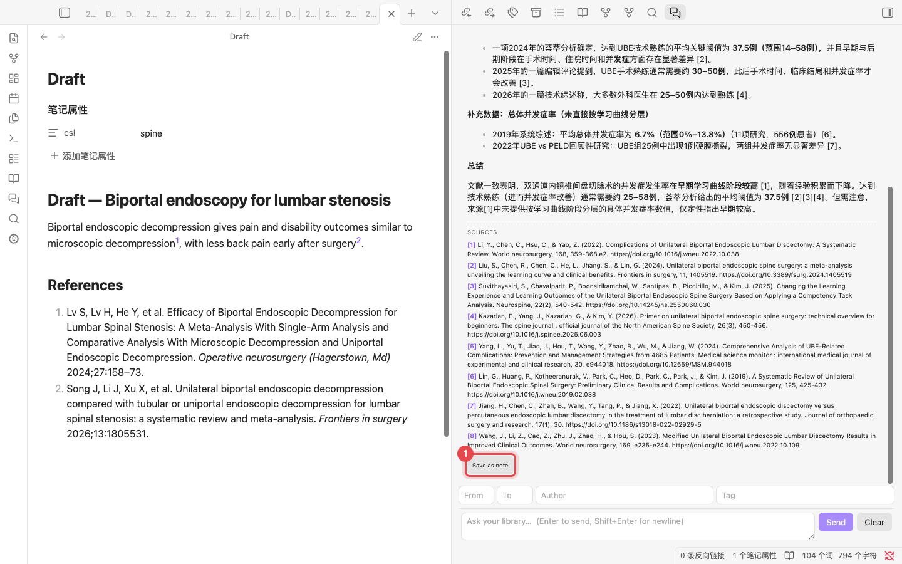

1. **SOURCES** 列出支持该答案的论文。**Save as note** 会把答案保存为 `Chat/` 文件夹中的笔记，并把来源转换为 `[@citekey]` 引用。

## 9. 相关论文

展示你的论文之间的引用关系。首次点击一次 **Build citation graph**，从 OpenAlex 获取引用数据（56 篇论文约需 40 秒）。

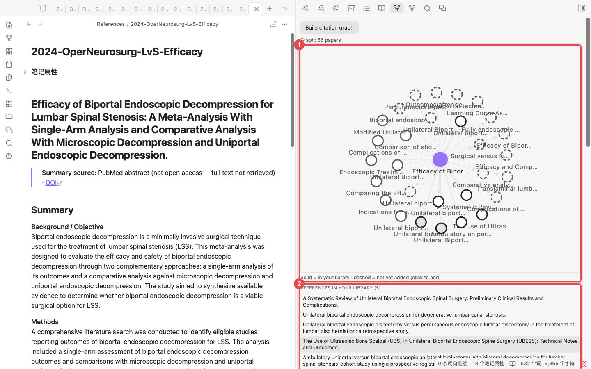

1. **引用地图**：紫色圆点是当前打开的论文。实线圆圈是你库中已有的论文，虚线圆圈是尚未收录的论文。点击虚线圆圈即可添加。
2. **列表**：依次是该论文引用的论文、引用该论文的论文、与该论文共享大量参考文献的论文，以及你的库中经常被引用但尚未收录的论文。

## 10. 完成原稿并导出为 Word

所有命令都在命令面板中（<kbd>Cmd/Ctrl</kbd>+<kbd>P</kbd>）。输入 "Refwright" 即可列出全部命令。

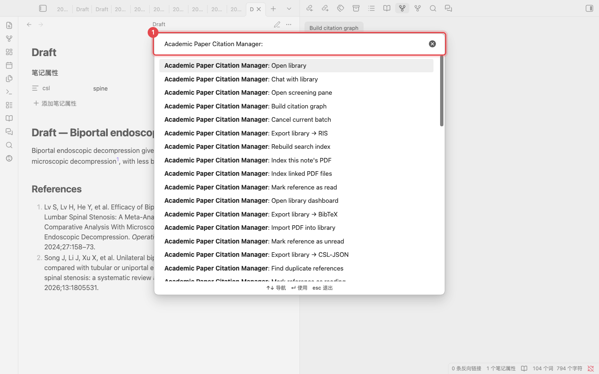

1. 在此输入命令名称的一部分。最常用的命令如下。

| 命令 | 作用 |
|---|---|
| Update bibliography in current note | 在原稿末尾写入 References 部分 |
| Compile manuscript | 生成一份副本，将 `[@citekey]` 替换为格式化引用 |
| Export manuscript to Word (.docx) | 先编译，再保存为 Word 文件（需要 [Pandoc](https://pandoc.org)） |
| Find unsupported claims | 列出未附引用的论断段落 |
| Suggest citations for selection | 为选中的句子推荐论文 |

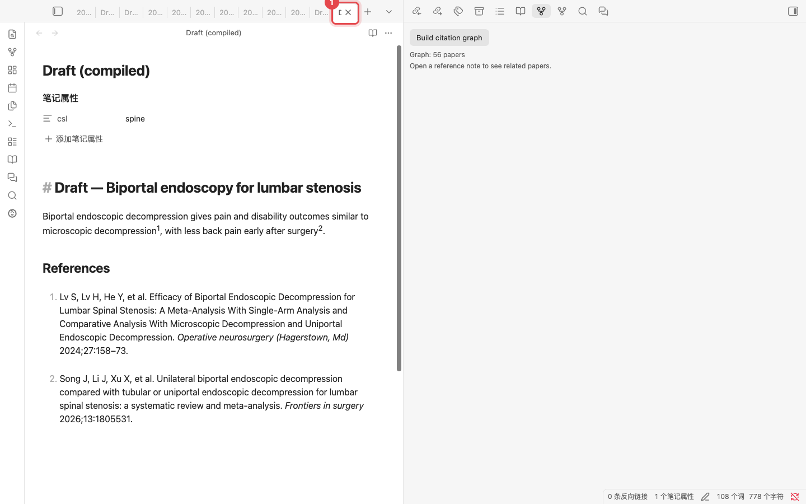

1. **Compile manuscript** 会保留原文不变，另外打开一个新的 **Draft (compiled)** 笔记。引用已格式化，参考文献列表已附上，可直接用于投稿。如需 Word 文件，运行 **Export manuscript to Word (.docx)**。

---

截图：插件 v0.7.8，测试库共 56 篇论文。聊天回答为模型原始输出，未经编辑。维护者用 `python scripts/manual/capture.py zh` 重新生成截图。
